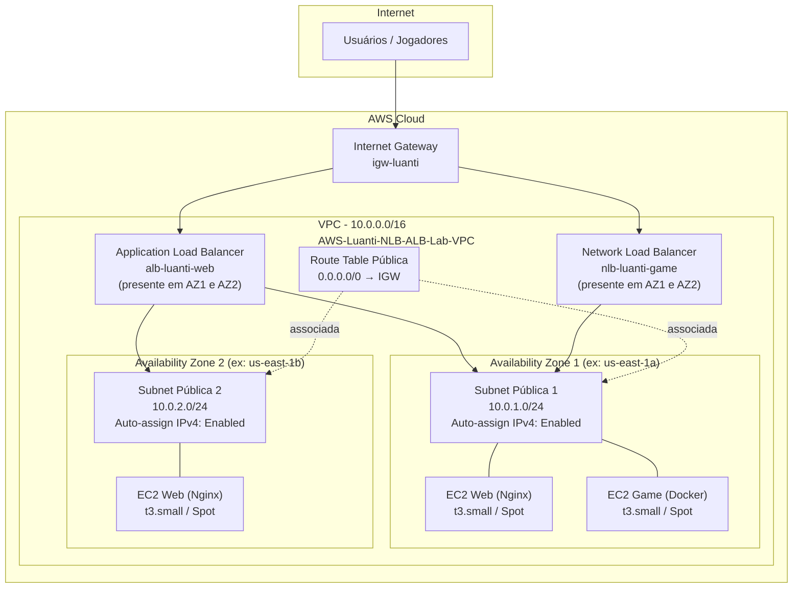
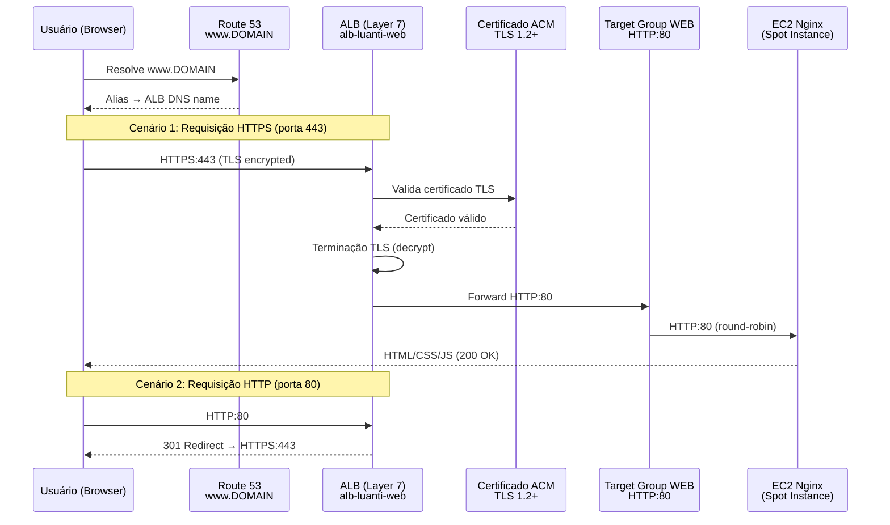
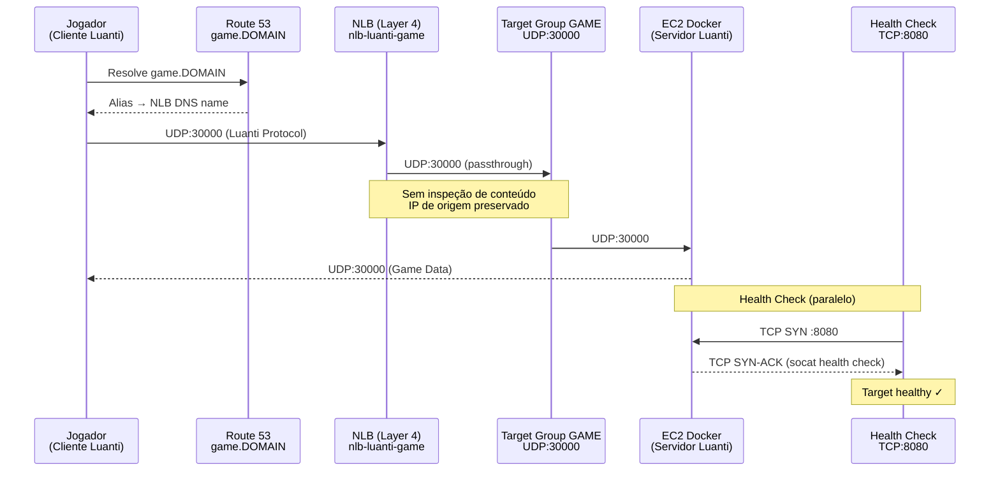
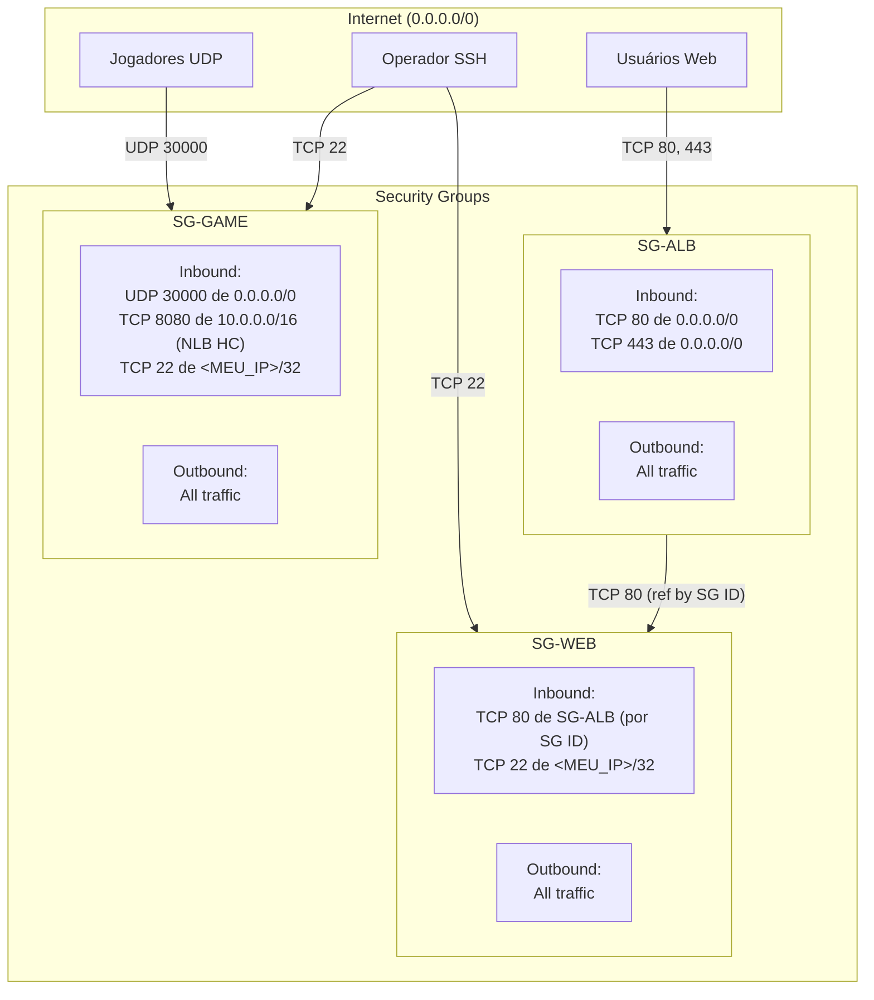
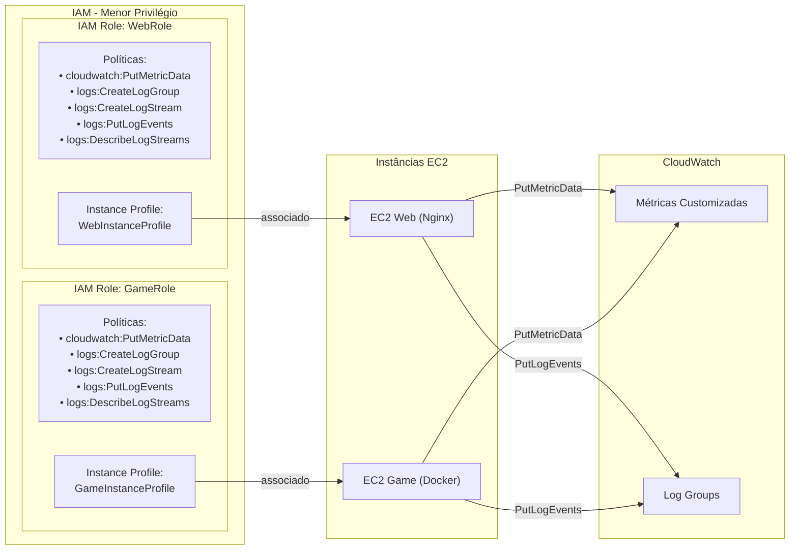
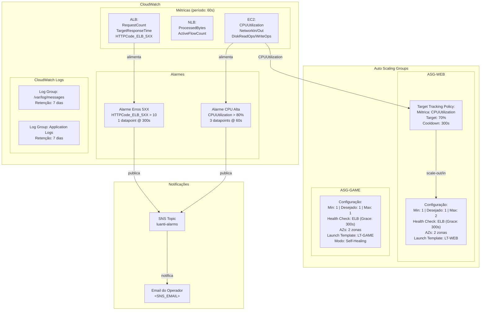
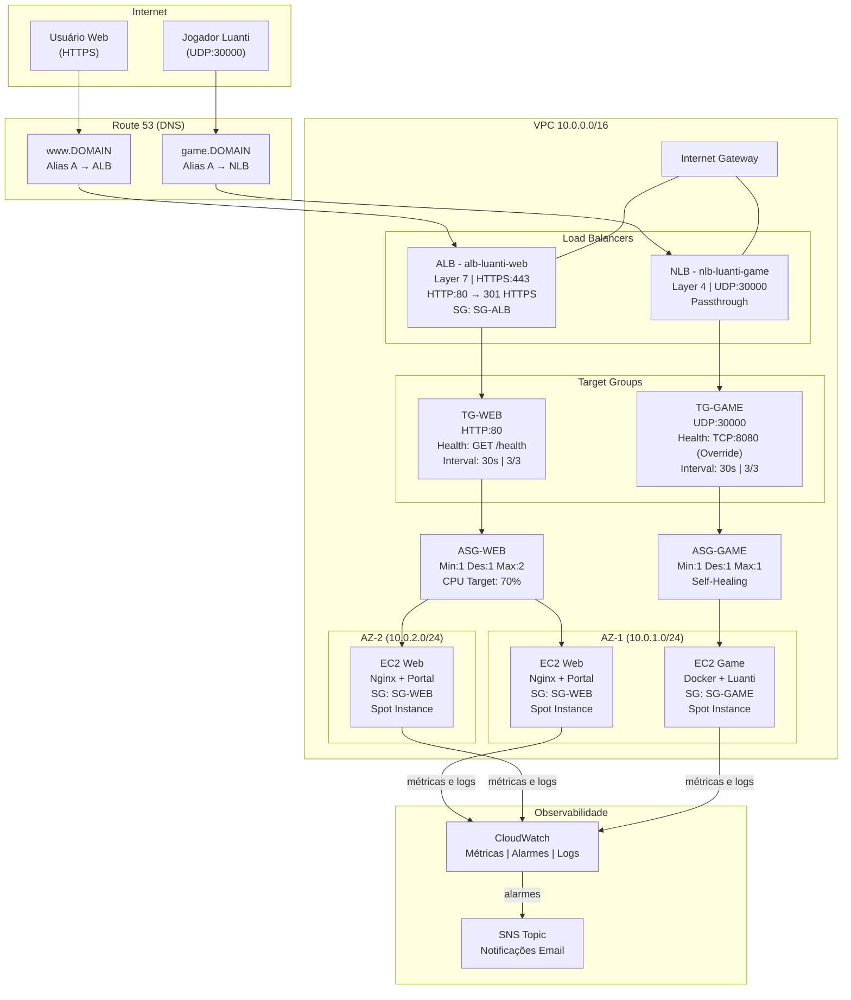

# Arquitetura do Projeto AWS Luanti ALB/NLB

Este documento apresenta a arquitetura completa do projeto AWS Luanti ALB/NLB por meio de diagramas detalhados e descrições técnicas. O objetivo é fornecer uma visão clara de como os componentes interagem, desde a topologia de rede até o monitoramento e observabilidade.

## Índice

1. [Topologia de Rede](#1-topologia-de-rede)
2. [Fluxo de Tráfego Web (Layer 7)](#2-fluxo-de-tráfego-web-layer-7)
3. [Fluxo de Tráfego Game (Layer 4)](#3-fluxo-de-tráfego-game-layer-4)
4. [Componentes de Segurança](#4-componentes-de-segurança)
5. [Auto Scaling e Monitoramento](#5-auto-scaling-e-monitoramento)
6. [Visão Geral da Arquitetura](#6-visão-geral-da-arquitetura)

## Documentos Relacionados

- [Guia de Implantação Manual (13 blocos)](./IMPLANTACAO-AWS.md)

---

## 1. Topologia de Rede

A topologia de rede ilustra a estrutura da VPC, incluindo as subnets públicas distribuídas em duas Availability Zones, o Internet Gateway que fornece conectividade com a internet, e as Route Tables que direcionam o tráfego. Todos os recursos são implantados em subnets públicas com atribuição automática de IP público, eliminando a necessidade de NAT Gateways.

### Detalhes da Topologia

| Componente | Configuração | Descrição |
|------------|-------------|-----------|
| VPC | 10.0.0.0/16 | Rede virtual privada com 65.536 endereços disponíveis |
| Subnet Pública 1 | 10.0.1.0/24 (AZ-1) | 256 endereços na primeira Availability Zone |
| Subnet Pública 2 | 10.0.2.0/24 (AZ-2) | 256 endereços na segunda Availability Zone |
| Internet Gateway | igw-luanti | Conectividade bidirecional com a internet |
| Route Table | 0.0.0.0/0 → IGW | Rota padrão para todo tráfego de saída |

Ambas as subnets possuem atribuição automática de IP público habilitada, permitindo que as instâncias EC2 sejam acessíveis diretamente pela internet através dos Load Balancers.

Para mais detalhes sobre a configuração de rede, consulte a documentação em `docs/REDE.md`.

---

## 2. Fluxo de Tráfego Web (Layer 7)

O fluxo de tráfego web demonstra como as requisições HTTPS dos usuários são processadas pelo Application Load Balancer. O ALB opera na Layer 7 (camada de aplicação), realizando a terminação TLS com certificado ACM e redirecionando requisições HTTP para HTTPS automaticamente. Após a terminação TLS, o tráfego é encaminhado em HTTP para as instâncias EC2 que executam Nginx.

### Características do Fluxo Web

- **Terminação TLS**: O ALB decifra o tráfego HTTPS usando o certificado ACM, eliminando a necessidade de gerenciar certificados nas instâncias EC2.
- **Redirect HTTP→HTTPS**: Toda requisição na porta 80 recebe resposta 301 (permanent redirect) para a porta 443, garantindo que todo tráfego seja criptografado.
- **Health Check**: O Target Group verifica a saúde das instâncias via `GET /health` (HTTP 200) a cada 30 segundos. Instâncias que falham 3 verificações consecutivas são removidas do pool.
- **Balanceamento**: O ALB distribui o tráfego entre as instâncias registradas no Target Group usando o algoritmo round-robin.

Para mais detalhes sobre o ALB, consulte a documentação em `docs/ALB.md`.

---

## 3. Fluxo de Tráfego Game (Layer 4)

O fluxo de tráfego do jogo demonstra como os pacotes UDP dos jogadores são roteados pelo Network Load Balancer. O NLB opera na Layer 4 (camada de transporte), realizando passthrough do tráfego UDP sem inspeção de conteúdo. Isso garante latência mínima e preservação do IP de origem, essenciais para a experiência de jogo em tempo real.

### Características do Fluxo Game

- **Passthrough UDP**: O NLB encaminha os pacotes UDP sem modificação, mantendo a baixa latência necessária para jogos.
- **Preservação de IP**: O IP de origem do jogador é preservado, permitindo que o servidor identifique cada cliente.
- **Health Check TCP (porta 8080)**: Como UDP não possui mecanismo nativo de confirmação de conexão, o health check utiliza TCP na porta 8080, onde um serviço `socat` verifica se o container Luanti está rodando e responde OK ao NLB.
- **Single Target**: O ASG-GAME mantém exatamente 1 instância (min=1, max=1), funcionando como self-healing sem escalabilidade horizontal.

Para mais detalhes sobre o NLB, consulte a documentação em `docs/NLB.md`.

---

## 4. Componentes de Segurança

O diagrama de segurança ilustra os Security Groups, IAM Roles e suas relações. A arquitetura segue o princípio de menor privilégio: cada componente recebe apenas as permissões necessárias para sua função, e o tráfego entre camadas é controlado por referência de Security Group ID.

### IAM Roles e Permissões

### Princípios de Segurança Aplicados

| Princípio | Implementação |
|-----------|--------------|
| Menor privilégio (SGs) | SG-WEB aceita tráfego apenas do SG-ALB, não de 0.0.0.0/0 |
| Referência por SG ID | Regras cross-reference usam Security Group ID em vez de CIDR |
| Menor privilégio (IAM) | Roles sem wildcards em Actions, Resource limitado ao escopo necessário |
| Separação de responsabilidades | Roles distintas para web e game com permissões independentes |
| Acesso SSH restrito | Porta 22 disponível apenas para o IP do operador |
| Sem regras desnecessárias | Nenhuma porta de entrada além das explicitamente definidas |

Para mais detalhes sobre a configuração de segurança, consulte a documentação em `docs/SEGURANCA.md`.

---

## 5. Auto Scaling e Monitoramento

Este diagrama mostra a integração entre os Auto Scaling Groups, CloudWatch (métricas e alarmes), SNS (notificações) e as políticas de escalabilidade. O ASG-WEB escala horizontalmente com base na utilização de CPU, enquanto o ASG-GAME opera em modo self-healing com capacidade fixa.

### Comportamento de Auto Scaling

| Evento | ASG-WEB | ASG-GAME |
|--------|---------|----------|
| CPU > 70% (sustentada) | Scale-out: lança nova instância (até max=2) | Não se aplica (max=1) |
| CPU < 70% (estabilizada) | Scale-in: termina instância extra (até min=1) | Não se aplica |
| Instância unhealthy | Substitui instância após grace period (300s) | Substitui instância após grace period (300s) |
| Spot interrompida | ASG lança nova instância automaticamente | ASG lança nova instância automaticamente |
| Health check ELB falha | Marca instância como unhealthy → substitui | Marca instância como unhealthy → substitui |

### Alarmes e Thresholds

| Alarme | Métrica | Condição | Período | Ação |
|--------|---------|----------|---------|------|
| CPU Alta | CPUUtilization | > 80% por 3 datapoints | 60s cada | Publica em SNS |
| Erros 5XX | HTTPCode_ELB_5XX | > 10 ocorrências | 300s (5 min) | Publica em SNS |

### Fluxo de Self-Healing

1. Instância EC2 falha (crash, Spot interruption, container morto)
2. Health check do Target Group detecta falha (3 verificações consecutivas falharam)
3. ASG marca a instância como unhealthy
4. ASG termina a instância unhealthy
5. ASG lança nova instância usando o Launch Template
6. User Data provisiona a aplicação automaticamente
7. Após grace period (300s), health check confirma a nova instância como healthy

Para mais detalhes sobre Spot Instances e Auto Scaling, consulte a documentação em `docs/SPOT-AUTOSCALING.md`.
Para configuração detalhada de monitoramento, consulte a documentação em `docs/MONITORAMENTO.md`.

---

## 6. Visão Geral da Arquitetura

O diagrama a seguir apresenta uma visão consolidada de todos os componentes e suas interações, desde a entrada do tráfego pela internet até as instâncias EC2, passando por DNS, Load Balancers, Target Groups e Auto Scaling Groups.

### Resumo dos Componentes

| Camada | Componente | Função |
|--------|-----------|--------|
| DNS | Route 53 | Resolução de nomes com Alias records para ALB e NLB |
| Edge | ALB (Layer 7) | Terminação TLS, redirect HTTP→HTTPS, balanceamento web |
| Edge | NLB (Layer 4) | Passthrough UDP para tráfego de jogo |
| Roteamento | Target Groups | Registro de instâncias e health checks |
| Compute | Auto Scaling Groups | Gerenciamento de capacidade e self-healing |
| Compute | EC2 Spot Instances | Execução das aplicações com otimização de custos |
| Segurança | Security Groups | Controle de tráfego entre camadas |
| Segurança | IAM Roles | Permissões de menor privilégio para instâncias |
| Observabilidade | CloudWatch | Métricas, alarmes e logs centralizados |
| Notificação | SNS | Envio de alertas por email ao operador |

---

## Próximos Passos

Para implantar esta arquitetura, siga o [Guia de Implantação Manual](./IMPLANTACAO-AWS.md) que contém instruções passo a passo para criação de cada recurso via Console AWS, organizadas em 13 blocos sequenciais.
