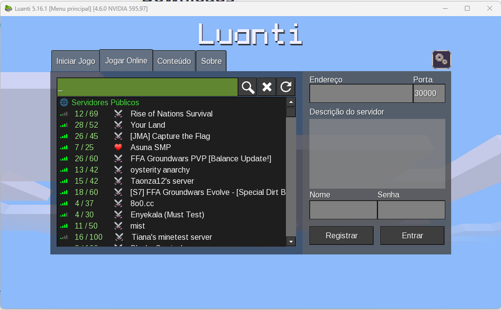
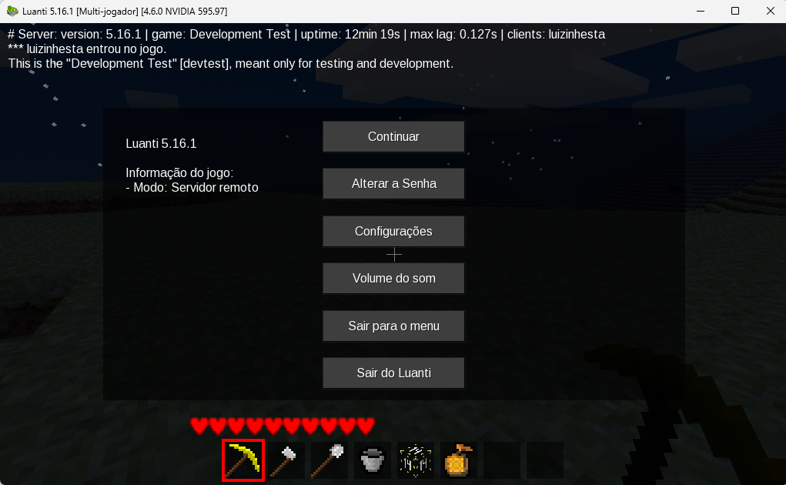
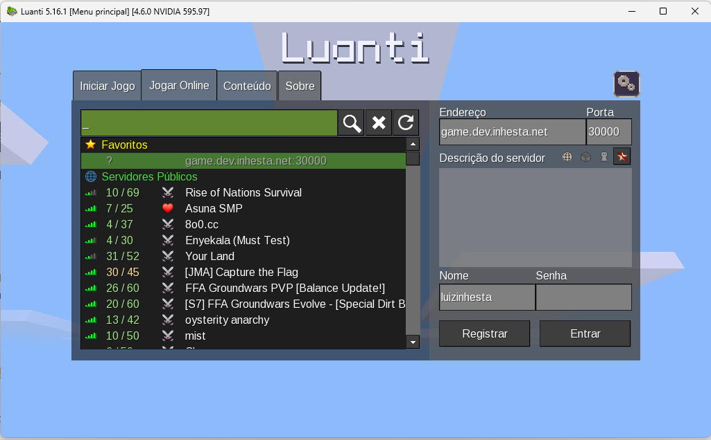
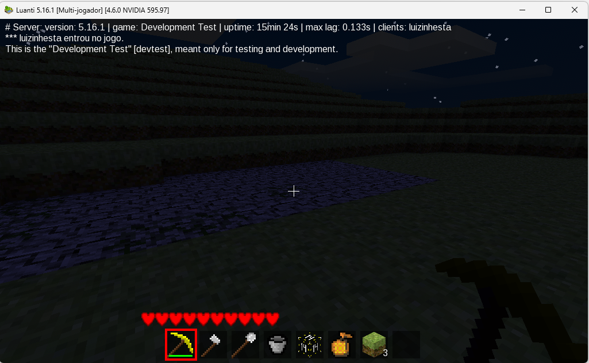
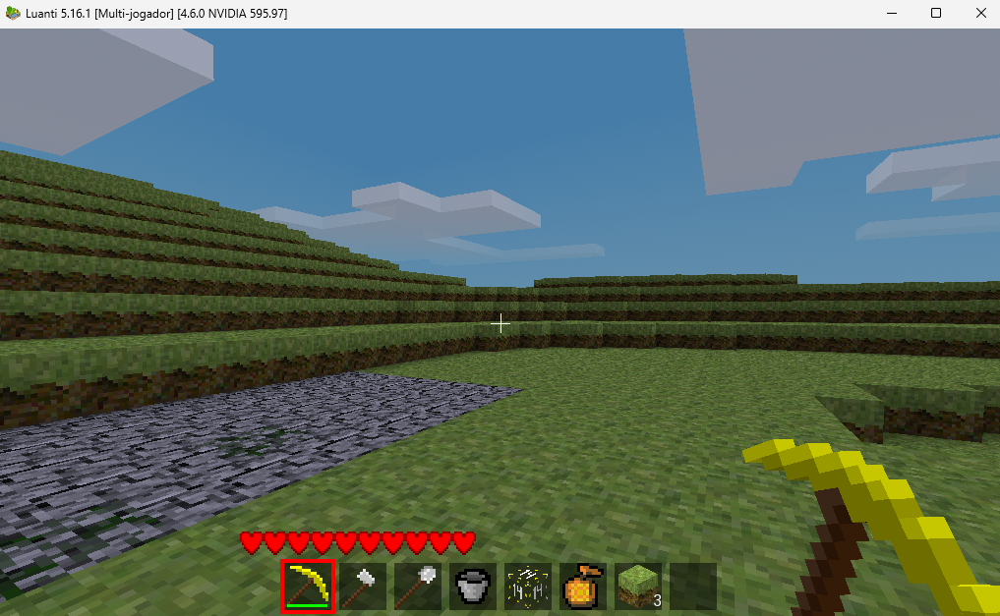
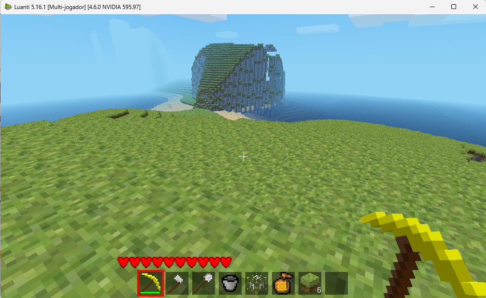

# Guia de Implantação Manual — AWS Load Balancing ALB/NLB - Luanti

> **Documento**: Instruções passo a passo para criação manual de todos os recursos AWS via Console.
> **Método**: Console AWS (sem Infrastructure as Code).
> **Ordem**: 13 blocos sequenciais com dependências respeitadas.

---

## Índice

- [Bloco 1 — VPC e Rede](#bloco-1--vpc-e-rede)
- [Bloco 2 — Security Groups](#bloco-2--security-groups)
- [Bloco 3 — IAM Roles e Instance Profiles](#bloco-3--iam-roles-e-instance-profiles)
- [Bloco 4 — Launch Templates](#bloco-4--launch-templates)
- [Bloco 5 — Target Groups](#bloco-5--target-groups)
- [Bloco 6 — Application Load Balancer (ALB)](#bloco-6--application-load-balancer-alb)
- [Bloco 7 — Network Load Balancer (NLB)](#bloco-7--network-load-balancer-nlb)
- [Bloco 8 — Auto Scaling Groups](#bloco-8--auto-scaling-groups)
- [Bloco 9 — DNS Route 53](#bloco-9--dns-route-53)
- [Bloco 10 — Certificado ACM](#bloco-10--certificado-acm)
- [Bloco 11 — CloudWatch Alarmes](#bloco-11--cloudwatch-alarmes)
- [Bloco 12 — CloudWatch Logs](#bloco-12--cloudwatch-logs)
- [Bloco 13 — SNS Topics](#bloco-13--sns-topics)

---

## Bloco 1 — VPC e Rede

---

### 1.1 Criar a VPC

1. Acesse **VPC** → **Your VPCs** → **Create VPC**.
2. Selecione **VPC only** (não utilizar o assistente "VPC and more").
3. Preencha os campos:

| Campo | Valor |
|-------|-------|
| **Name tag** | `AWS-Luanti-NLB-ALB-Lab-VPC` |
| **IPv4 CIDR block** | `10.0.0.0/16` |
| **IPv6 CIDR block** | No IPv6 CIDR block |
| **Tenancy** | Default |

4. Clique em **Create VPC**.
6. Anote o **VPC ID** gerado (formato: `vpc-xxxxxxxxxxxxxxxxx`).

.png)

---

### 1.2 Criar Subnet Pública — AZ-1

1. Acesse **VPC** → **Subnets** → **Create subnet**.
2. Preencha os campos:

| Campo | Valor |
|-------|-------|
| **VPC ID** | Selecione `AWS-Luanti-NLB-ALB-Lab-VPC` |
| **Subnet name** | `AWS-Luanti-NLB-ALB-Lab-PublicSubnet-AZ1` |
| **Availability Zone** | Selecione a **primeira AZ** disponível (ex: `us-east-1a`) |
| **IPv4 subnet CIDR block** | `10.0.1.0/24` |

3. Clique em **Create subnet**.
4. Anote o **Subnet ID** gerado.

---

### 1.3 Criar Subnet Pública — AZ-2

1. Acesse **VPC** → **Subnets** → **Create subnet**.
2. Preencha os campos:

| Campo | Valor |
|-------|-------|
| **VPC ID** | Selecione `AWS-Luanti-NLB-ALB-Lab-VPC` |
| **Subnet name** | `AWS-Luanti-NLB-ALB-Lab-PublicSubnet-AZ2` |
| **Availability Zone** | Selecione a **segunda AZ** disponível (ex: `us-east-1b`) |
| **IPv4 subnet CIDR block** | `10.0.2.0/24` |

3. Clique em **Create subnet**.
4. Anote o **Subnet ID** gerado.

.png)

---

### 1.4 Habilitar Auto-assign IP Público nas Subnets

Para **cada uma** das duas subnets criadas:

1. Acesse **VPC** → **Subnets**.
2. Selecione a subnet (ex: `AWS-Luanti-NLB-ALB-Lab-PublicSubnet-AZ1`).
3. Clique em **Actions** → **Edit subnet settings**.
4. Marque a opção **Enable auto-assign public IPv4 address**.
5. Clique em **Save**.
6. Repita para a segunda subnet (`AWS-Luanti-NLB-ALB-Lab-PublicSubnet-AZ2`).

---

### 1.5 Criar Internet Gateway

1. Acesse **VPC** → **Internet gateways** → **Create internet gateway**.
2. Preencha os campos:

| Campo | Valor |
|-------|-------|
| **Name tag** | `AWS-Luanti-NLB-ALB-Lab-IGW` |

3. Clique em **Create internet gateway**.
4. Na tela de confirmação, clique em **Attach to VPC**.
6. Selecione `AWS-Luanti-NLB-ALB-Lab-VPC`.
7. Clique em **Attach internet gateway**.

.png)

---

### 1.6 Criar Route Table Pública

1. Acesse **VPC** → **Route tables** → **Create route table**.
2. Preencha os campos:

| Campo | Valor |
|-------|-------|
| **Name tag** | `AWS-Luanti-NLB-ALB-Lab-PublicRT` |
| **VPC** | Selecione `AWS-Luanti-NLB-ALB-Lab-VPC` |

3. Clique em **Create route table**.

.png)

---

### 1.7 Adicionar Rota Padrão ao Internet Gateway

1. Selecione a Route Table `AWS-Luanti-NLB-ALB-Lab-PublicRT`.
2. Clique na aba **Routes** → **Edit routes** → **Add route**.
3. Preencha:

| Campo | Valor |
|-------|-------|
| **Destination** | `0.0.0.0/0` |
| **Target** | Selecione **Internet Gateway** → `AWS-Luanti-NLB-ALB-Lab-IGW` |

4. Clique em **Save changes**.

---

### 1.8 Associar Route Table às Subnets Públicas

1. Selecione a Route Table `AWS-Luanti-NLB-ALB-Lab-PublicRT`.
2. Clique na aba **Subnet associations** → **Edit subnet associations**.
3. Marque as duas subnets:
   - `AWS-Luanti-NLB-ALB-Lab-PublicSubnet-AZ1`
   - `AWS-Luanti-NLB-ALB-Lab-PublicSubnet-AZ2`
4. Clique em **Save associations**.

.png)

---

## Bloco 2 — Security Groups

---

### 2.1 Criar Security Group — SG-ALB

1. Acesse **VPC** → **Security groups** → **Create security group**.
2. Preencha os campos:

| Campo | Valor |
|-------|-------|
| **Security group name** | `SG-ALB` |
| **Description** | `Security Group para o Application Load Balancer - permite HTTP e HTTPS de qualquer origem` |
| **VPC** | Selecione `AWS-Luanti-NLB-ALB-Lab-VPC` |

3. Em **Inbound rules**, clique em **Add rule** e adicione:

| Type | Protocol | Port range | Source | Description |
|------|----------|------------|--------|-------------|
| HTTP | TCP | 80 | `0.0.0.0/0` | Tráfego HTTP público |
| HTTPS | TCP | 443 | `0.0.0.0/0` | Tráfego HTTPS público |

4. Em **Outbound rules**, mantenha a regra padrão:

| Type | Protocol | Port range | Destination |
|------|----------|------------|-------------|
| All traffic | All | All | `0.0.0.0/0` |

5. Clique em **Create security group**.
6. Anote o **Security Group ID** (formato: `sg-xxxxxxxxxxxxxxxxx`).

---

### 2.2 Criar Security Group — SG-WEB

1. Acesse **VPC** → **Security groups** → **Create security group**.
2. Preencha os campos:

| Campo | Valor |
|-------|-------|
| **Security group name** | `SG-WEB` |
| **Description** | `Security Group para instâncias web - permite HTTP apenas do ALB` |
| **VPC** | Selecione `AWS-Luanti-NLB-ALB-Lab-VPC` |

3. Em **Inbound rules**, clique em **Add rule** e adicione:

| Type | Protocol | Port range | Source | Description |
|------|----------|------------|--------|-------------|
| HTTP | TCP | 80 | **Custom**: digite o **Security Group ID** do `SG-ALB` (ex: `sg-xxxxxxxxxxxxxxxxx`) | Tráfego HTTP do ALB |

> ⚠️ **Importante**: Utilize a referência por **Security Group ID**, não por CIDR. Ao digitar `sg-` no campo Source, o Console exibirá o SG-ALB para seleção.

4. Em **Outbound rules**, mantenha a regra padrão (All traffic → 0.0.0.0/0).

5. Clique em **Create security group**.
6. Anote o **Security Group ID**.

---

### 2.3 Criar Security Group — SG-GAME

1. Acesse **VPC** → **Security groups** → **Create security group**.
2. Preencha os campos:

| Campo | Valor |
|-------|-------|
| **Security group name** | `SG-GAME` |
| **Description** | `Security Group para instâncias de jogo - permite UDP 30000 de qualquer origem` |
| **VPC** | Selecione `AWS-Luanti-NLB-ALB-Lab-VPC` |

3. Em **Inbound rules**, clique em **Add rule** e adicione:

| Type | Protocol | Port range | Source | Description |
|------|----------|------------|--------|-------------|
| Custom UDP | UDP | 30000 | `0.0.0.0/0` | Tráfego UDP Luanti de qualquer origem |
| Custom TCP | TCP | 8080 | `10.0.0.0/16` | Health check do NLB (socat) |

4. Em **Outbound rules**, mantenha a regra padrão (All traffic → 0.0.0.0/0).

5. Clique em **Create security group**.
6. Anote o **Security Group ID**.

---

### 2.4 (Opcional) Adicionar Regra SSH para Acesso Administrativo

Se você necessita de acesso SSH para debugging, adicione esta regra aos Security Groups **SG-WEB** e **SG-GAME**:

1. Selecione o Security Group (SG-WEB ou SG-GAME).
2. Clique na aba **Inbound rules** → **Edit inbound rules** → **Add rule**.
3. Preencha:

| Type | Protocol | Port range | Source | Description |
|------|----------|------------|--------|-------------|
| SSH | TCP | 22 | `<YOUR_IP>/32` (ex: `203.0.113.50/32`) | SSH restrito ao operador |

> ⚠️ **Importante**: **Nunca** utilize `0.0.0.0/0` como source para SSH. Restrinja ao seu IP público atual. Utilize o valor definido na variável `SSH_MY_IP` do `.env.example`.

4. Clique em **Save rules**.
5. Repita para o outro Security Group, se necessário.

.png)

---

## Bloco 3 — IAM Roles e Instance Profiles

---

### 3.1 Criar IAM Role — WebRole

1. Acesse **IAM** → **Roles** → **Create role**.
2. Em **Trusted entity type**, selecione **AWS service**.
3. Em **Use case**, selecione **EC2**.
4. Clique em **Next**.
5. Na tela de permissões, **não selecione nenhuma policy gerenciada** (criaremos uma custom policy depois).
6. Clique em **Next**.
7. Preencha:

| Campo | Valor |
|-------|-------|
| **Role name** | `AWS-Luanti-NLB-ALB-Lab-WebRole` |
| **Description** | `IAM Role para instâncias web do projeto AWS Luanti - CloudWatch Logs e Metrics` |

8. Clique em **Create role**.

---

### 3.2 Criar Política IAM — WebPolicy

1. Acesse **IAM** → **Policies** → **Create policy**.
2. Selecione a aba **JSON**.
3. Cole o seguinte JSON (substitua `<AWS_REGION>` e `<AWS_ACCOUNT_ID>` pelos valores reais):

```json
{
    "Version": "2012-10-17",
    "Statement": [
        {
            "Sid": "CloudWatchMetrics",
            "Effect": "Allow",
            "Action": [
                "cloudwatch:PutMetricData"
            ],
            "Resource": "*",
            "Condition": {
                "StringEquals": {
                    "cloudwatch:namespace": "AWS-Luanti/Web"
                }
            }
        },
        {
            "Sid": "CloudWatchLogsCreateGroup",
            "Effect": "Allow",
            "Action": [
                "logs:CreateLogGroup"
            ],
            "Resource": "arn:aws:logs:<AWS_REGION>:<AWS_ACCOUNT_ID>:log-group:*"
        },
        {
            "Sid": "CloudWatchLogsWrite",
            "Effect": "Allow",
            "Action": [
                "logs:CreateLogStream",
                "logs:PutLogEvents",
                "logs:DescribeLogStreams"
            ],
            "Resource": "arn:aws:logs:<AWS_REGION>:<AWS_ACCOUNT_ID>:log-group:/aws-luanti/web/*:*"
        }
    ]
}
```

4. Clique em **Next**.
5. Preencha:

| Campo | Valor |
|-------|-------|
| **Policy name** | `AWS-Luanti-NLB-ALB-Lab-WebPolicy` |
| **Description** | `Política de menor privilégio para instâncias web - CloudWatch Logs e Metrics` |

6. Clique em **Create policy**.

.png)

---

### 3.3 Associar WebPolicy à WebRole

1. Acesse **IAM** → **Roles** → selecione `AWS-Luanti-NLB-ALB-Lab-WebRole`.
2. Na aba **Permissions**, clique em **Add permissions** → **Attach policies**.
3. Pesquise por `AWS-Luanti-NLB-ALB-Lab-WebPolicy`.
4. Marque a policy e clique em **Add permissions**.

.png)

---

### 3.4 Criar IAM Role — GameRole

1. Acesse **IAM** → **Roles** → **Create role**.
2. Em **Trusted entity type**, selecione **AWS service**.
3. Em **Use case**, selecione **EC2**.
4. Clique em **Next**.
5. Na tela de permissões, **não selecione nenhuma policy gerenciada**.
6. Clique em **Next**.
7. Preencha:

| Campo | Valor |
|-------|-------|
| **Role name** | `AWS-Luanti-NLB-ALB-Lab-GameRole` |
| **Description** | `IAM Role para instâncias de jogo do projeto AWS Luanti - CloudWatch Logs e Metrics` |

8. Clique em **Create role**.

---

### 3.5 Criar Política IAM — GamePolicy

1. Acesse **IAM** → **Policies** → **Create policy**.
2. Selecione a aba **JSON**.
3. Cole o seguinte JSON (substitua `<AWS_REGION>` e `<AWS_ACCOUNT_ID>` pelos valores reais):

```json
{
    "Version": "2012-10-17",
    "Statement": [
        {
            "Sid": "CloudWatchMetrics",
            "Effect": "Allow",
            "Action": [
                "cloudwatch:PutMetricData"
            ],
            "Resource": "*",
            "Condition": {
                "StringEquals": {
                    "cloudwatch:namespace": "AWS-Luanti/Game"
                }
            }
        },
        {
            "Sid": "CloudWatchLogsCreateGroup",
            "Effect": "Allow",
            "Action": [
                "logs:CreateLogGroup"
            ],
            "Resource": "arn:aws:logs:<AWS_REGION>:<AWS_ACCOUNT_ID>:log-group:*"
        },
        {
            "Sid": "CloudWatchLogsWrite",
            "Effect": "Allow",
            "Action": [
                "logs:CreateLogStream",
                "logs:PutLogEvents",
                "logs:DescribeLogStreams"
            ],
            "Resource": "arn:aws:logs:<AWS_REGION>:<AWS_ACCOUNT_ID>:log-group:/aws-luanti/game/*:*"
        }
    ]
}
```

4. Clique em **Next**.
5. Preencha:

| Campo | Valor |
|-------|-------|
| **Policy name** | `AWS-Luanti-NLB-ALB-Lab-GamePolicy` |
| **Description** | `Política de menor privilégio para instâncias de jogo - CloudWatch Logs e Metrics` |

6. Clique em **Create policy**.

.png)

---

### 3.6 Associar GamePolicy à GameRole

1. Acesse **IAM** → **Roles** → selecione `AWS-Luanti-NLB-ALB-Lab-GameRole`.
2. Na aba **Permissions**, clique em **Add permissions** → **Attach policies**.
3. Pesquise por `AWS-Luanti-NLB-ALB-Lab-GamePolicy`.
4. Marque a policy e clique em **Add permissions**.

---

### 3.7 Verificar Instance Profiles (Criados Automaticamente)


```bash
# Verificar Instance Profile da WebRole
aws iam get-instance-profile \
  --instance-profile-name AWS-Luanti-NLB-ALB-Lab-WebRole

# Verificar Instance Profile da GameRole
aws iam get-instance-profile \
  --instance-profile-name AWS-Luanti-NLB-ALB-Lab-GameRole
```

Se por algum motivo os Instance Profiles não foram criados automaticamente, crie-os manualmente:

```bash
# Criar Instance Profile para WebRole (se necessário)
aws iam create-instance-profile \
  --instance-profile-name AWS-Luanti-NLB-ALB-Lab-WebRole

aws iam add-role-to-instance-profile \
  --instance-profile-name AWS-Luanti-NLB-ALB-Lab-WebRole \
  --role-name AWS-Luanti-NLB-ALB-Lab-WebRole

# Criar Instance Profile para GameRole (se necessário)
aws iam create-instance-profile \
  --instance-profile-name AWS-Luanti-NLB-ALB-Lab-GameRole

aws iam add-role-to-instance-profile \
  --instance-profile-name AWS-Luanti-NLB-ALB-Lab-GameRole \
  --role-name AWS-Luanti-NLB-ALB-Lab-GameRole
```

---

## Bloco 4 — Launch Templates

---

### 4.1 Criar Launch Template — LT-WEB

1. Acesse **EC2** → **Launch Templates** → **Create launch template**.
2. Preencha os campos:

#### Informações do Launch Template

| Campo | Valor |
|-------|-------|
| **Launch template name** | `AWS-Luanti-NLB-ALB-Lab-LT-WEB` |
| **Template version description** | `v1 - Nginx web server com portal Luanti` |

#### Application and OS Images (AMI)

| Campo | Valor |
|-------|-------|
| **AMI** | Amazon Linux 2023 AMI (selecione a mais recente via "Browse more AMIs" → filtrar por "Amazon Linux 2023") |

#### Instance type

| Campo | Valor |
|-------|-------|
| **Instance type** | `t3.small` (tipo primário — tipos adicionais serão configurados no ASG) |

#### Key pair (login)

| Campo | Valor |
|-------|-------|
| **Key pair name** | Selecione um key pair existente ou crie um novo (necessário para SSH) |

#### Network settings

| Campo | Valor |
|-------|-------|
| **Security groups** | Selecione `SG-WEB` |

#### Advanced details — IAM Instance Profile

| Campo | Valor |
|-------|-------|
| **IAM instance profile** | Selecione `AWS-Luanti-NLB-ALB-Lab-WebRole` |

#### Advanced details — Purchasing option

| Campo | Valor |
|-------|-------|
| **Request Spot Instances** | ✅ Habilitado |
| **Spot request type** | One-time |
| **Interruption behavior** | Terminate |

#### Advanced details — User Data

No campo **User Data**, cole o conteúdo completo do script `scripts/user-data-web.sh` do repositório.

> **Referência**: O script completo está disponível em [`scripts/user-data-web.sh`](scripts/user-data-web.sh). Copie e cole o conteúdo inteiro no campo User Data.

O script realiza as seguintes operações:
- Atualiza pacotes do sistema
- Instala Nginx
- Baixa/copia os arquivos do portal web
- Configura o endpoint `/health`
- Instala e configura o CloudWatch Agent
- Inicia o serviço Nginx

3. Na seção **Tags** (em "Resource tags"), adicione as tags que serão aplicadas às instâncias criadas:

| Key | Value |
|-----|-------|
| `Project` | `AWS-Luanti-NLB-ALB` |
| `Environment` | `Lab` |
| `ManagedBy` | `Console` |
| `Name` | `AWS-Luanti-NLB-ALB-Lab-Web` |
| `Role` | `Web` |

4. Clique em **Create launch template**.

---

### 4.2 Configuração de Múltiplos Tipos de Instância (LT-WEB)


Tipos de instância configurados para o pool web:

| Tipo | vCPU | Memória | Família |
|------|------|---------|---------|
| `t3.small` | 2 | 2 GB | Nitro (primário) |
| `t3a.small` | 2 | 2 GB | Nitro AMD |
| `t2.small` | 1 | 2 GB | Legado |

---

### 4.3 Criar Launch Template — LT-GAME

1. Acesse **EC2** → **Launch Templates** → **Create launch template**.
2. Preencha os campos:

#### Informações do Launch Template

| Campo | Valor |
|-------|-------|
| **Launch template name** | `AWS-Luanti-NLB-ALB-Lab-LT-GAME` |
| **Template version description** | `v1 - Servidor Luanti em Docker` |

#### Application and OS Images (AMI)

| Campo | Valor |
|-------|-------|
| **AMI** | Amazon Linux 2023 AMI (mesma AMI utilizada no LT-WEB) |

#### Instance type

| Campo | Valor |
|-------|-------|
| **Instance type** | `t3.small` (tipo primário — tipos adicionais serão configurados no ASG) |

#### Key pair (login)

| Campo | Valor |
|-------|-------|
| **Key pair name** | Selecione o mesmo key pair utilizado no LT-WEB |

#### Network settings

| Campo | Valor |
|-------|-------|
| **Security groups** | Selecione `SG-GAME` |

#### Advanced details — IAM Instance Profile

| Campo | Valor |
|-------|-------|
| **IAM instance profile** | Selecione `AWS-Luanti-NLB-ALB-Lab-GameRole` |

#### Advanced details — Purchasing option

| Campo | Valor |
|-------|-------|
| **Request Spot Instances** | ✅ Habilitado |
| **Spot request type** | One-time |
| **Interruption behavior** | Terminate |

#### Advanced details — User Data

No campo **User Data**, cole o conteúdo completo do script `scripts/user-data-game.sh` do repositório.

> **Referência**: O script completo está disponível em [`scripts/user-data-game.sh`](scripts/user-data-game.sh). Copie e cole o conteúdo inteiro no campo User Data.

O script realiza as seguintes operações:
- Atualiza pacotes do sistema
- Instala Docker
- Inicia o serviço Docker
- Baixa a imagem `lscr.io/linuxserver/luanti:latest`
- Inicia o container na porta UDP/TCP 30000
- Configura serviço de health check TCP na porta 8080 (socat)
- Instala e configura o CloudWatch Agent
- Provisionamento completo em até 300 segundos

3. Na seção **Tags** (em "Resource tags"), adicione as tags que serão aplicadas às instâncias criadas:

| Key | Value |
|-----|-------|
| `Project` | `AWS-Luanti-NLB-ALB` |
| `Environment` | `Lab` |
| `ManagedBy` | `Console` |
| `Name` | `AWS-Luanti-NLB-ALB-Lab-Game` |
| `Role` | `Game` |

4. Clique em **Create launch template**.

---

### 4.4 Configuração de Múltiplos Tipos de Instância (LT-GAME)


Tipos de instância configurados para o pool de jogo:

| Tipo | vCPU | Memória | Família |
|------|------|---------|---------|
| `t3.small` | 2 | 2 GB | Nitro (primário) |
| `t3a.small` | 2 | 2 GB | Nitro AMD |
| `t2.small` | 1 | 2 GB | Legado |

.png)
.png)

---

### 4.5 Resumo dos Launch Templates

| Launch Template | Nome | AMI | Spot | Instance Profile | Security Group | User Data |
|----------------|------|-----|------|-----------------|----------------|-----------|
| LT-WEB | `AWS-Luanti-NLB-ALB-Lab-LT-WEB` | Amazon Linux 2023 | ✅ Terminate | `AWS-Luanti-NLB-ALB-Lab-WebRole` | `SG-WEB` | `user-data-web.sh` |
| LT-GAME | `AWS-Luanti-NLB-ALB-Lab-LT-GAME` | Amazon Linux 2023 | ✅ Terminate | `AWS-Luanti-NLB-ALB-Lab-GameRole` | `SG-GAME` | `user-data-game.sh` |

---

## Bloco 5 — Target Groups

.png)

---

### 5.1 Criar Target Group — TG-WEB (HTTP)

1. Acesse **EC2** → **Target Groups** → **Create target group**.
2. Em **Choose a target type**, selecione **Instances**.
3. Preencha os campos:

| Campo | Valor |
|-------|-------|
| **Target group name** | `TG-WEB` |
| **Protocol** | `HTTP` |
| **Port** | `80` |
| **VPC** | Selecione `AWS-Luanti-NLB-ALB-Lab-VPC` |
| **Protocol version** | `HTTP1` |

4. Na seção **Health checks**, configure:

| Campo | Valor |
|-------|-------|
| **Health check protocol** | `HTTP` |
| **Health check path** | `/health` |

5. Expanda **Advanced health check settings**:

| Campo | Valor |
|-------|-------|
| **Port** | `Traffic port` |
| **Healthy threshold** | `3` |
| **Unhealthy threshold** | `3` |
| **Timeout** | `5` segundos |
| **Interval** | `30` segundos |
| **Success codes** | `200` |

6. Clique em **Next**.
8. Na tela **Register targets**, **não registre targets agora** (o ASG fará isso automaticamente no Bloco 8).
9. Clique em **Create target group**.

.png)

---

### 5.2 Criar Target Group — TG-GAME (UDP)

1. Acesse **EC2** → **Target Groups** → **Create target group**.
2. Em **Choose a target type**, selecione **Instances**.
3. Preencha os campos:

| Campo | Valor |
|-------|-------|
| **Target group name** | `TG-GAME` |
| **Protocol** | `UDP` |
| **Port** | `30000` |
| **VPC** | Selecione `AWS-Luanti-NLB-ALB-Lab-VPC` |

4. Na seção **Health checks**, configure:

| Campo | Valor |
|-------|-------|
| **Health check protocol** | `TCP` |
| **Health check port** | Selecione **Override** e digite `8080` |

> ⚠️ **Nota**: Target Groups UDP não suportam health check via UDP. Utilizamos TCP na porta 8080 (Override), onde o script `user-data-game.sh` configura um serviço `socat` que responde OK quando o container Luanti está rodando. Esta abordagem é mais confiável que verificar TCP na porta do jogo.

5. Expanda **Advanced health check settings**:

| Campo | Valor |
|-------|-------|
| **Healthy threshold** | `3` |
| **Unhealthy threshold** | `3` |
| **Timeout** | `10` segundos |
| **Interval** | `30` segundos |

6. Clique em **Next**.
7. Na tela **Register targets**, **não registre targets agora** (o ASG fará isso automaticamente no Bloco 8).
9. Clique em **Create target group**.

.png)

---

### 5.3 Resumo dos Target Groups

| Target Group | Protocolo | Porta | Health Check | Porta HC | Path | Intervalo | Threshold |
|--------------|-----------|-------|--------------|----------|------|-----------|-----------|
| `TG-WEB` | HTTP | 80 | HTTP | Traffic port | `/health` | 30s | 3/3 |
| `TG-GAME` | UDP | 30000 | TCP | 8080 (Override) | — | 30s | 3/3 |

---

## Bloco 6 — Application Load Balancer (ALB)

> ⚠️ **Pré-requisito obrigatório**: O certificado ACM deve estar no estado **"Issued"** antes de configurar o listener HTTPS. Se o certificado ainda não foi criado/validado, execute primeiro o [Bloco 10 — Certificado ACM](#bloco-10--certificado-acm) e retorne a este bloco após a validação.

.png)

---

### 6.1 Criar o Application Load Balancer

1. Acesse **EC2** → **Load Balancers** → **Create Load Balancer**.
2. Em **Load balancer types**, selecione **Application Load Balancer** → **Create**.
3. Preencha os campos:

#### Basic configuration

| Campo | Valor |
|-------|-------|
| **Load balancer name** | `alb-luanti-web` |
| **Scheme** | `Internet-facing` |
| **IP address type** | `IPv4` |

#### Network mapping

| Campo | Valor |
|-------|-------|
| **VPC** | Selecione `AWS-Luanti-NLB-ALB-Lab-VPC` |
| **Availability Zones** | Marque **ambas** as AZs e selecione as subnets públicas correspondentes: |
| | `AWS-Luanti-NLB-ALB-Lab-PublicSubnet-AZ1` |
| | `AWS-Luanti-NLB-ALB-Lab-PublicSubnet-AZ2` |

#### Security groups

| Campo | Valor |
|-------|-------|
| **Security groups** | Selecione `SG-ALB` (remova o security group default se estiver selecionado) |

#### Listeners and routing

Configure o primeiro listener (HTTP):

| Campo | Valor |
|-------|-------|
| **Protocol** | `HTTP` |
| **Port** | `80` |
| **Default action** | `Redirect to` |
| **Protocol** | `HTTPS` |
| **Port** | `443` |
| **Status code** | `301 - Permanently moved` |

4. Clique em **Add listener** para adicionar o segundo listener (HTTPS):

| Campo | Valor |
|-------|-------|
| **Protocol** | `HTTPS` |
| **Port** | `443` |
| **Default action** | `Forward to` → Selecione `TG-WEB` |

#### Secure listener settings (HTTPS)

| Campo | Valor |
|-------|-------|
| **Security policy** | `ELBSecurityPolicy-TLS13-1-2-2021-06` (ou a mais recente disponível) |
| **Default SSL/TLS certificate** | `From ACM` → Selecione o certificado para seu domínio |

> ⚠️ **Importante**: Se o certificado ACM não aparecer na lista, verifique:
> - O certificado está na **mesma região** do ALB.
> - O certificado está no estado **"Issued"** (validação DNS concluída).
> - Consulte o [Bloco 10](#bloco-10--certificado-acm) para instruções de criação e validação.

5. Revise o **Summary** e clique em **Create load balancer**.
7. Aguarde o estado mudar para **Active** (pode levar 2–3 minutos).
8. Anote o **DNS name** do ALB (formato: `alb-luanti-web-XXXXXXXXX.<region>.elb.amazonaws.com`).

---

### 6.2 Verificar Listeners do ALB

Após a criação, confirme os listeners:

1. Acesse **EC2** → **Load Balancers** → selecione `alb-luanti-web`.
2. Clique na aba **Listeners and rules**.
3. Verifique:

| Listener | Porta | Ação |
|----------|-------|------|
| HTTP | 80 | Redirect para `HTTPS:443` (301) |
| HTTPS | 443 | Forward para `TG-WEB` |

---

## Bloco 7 — Network Load Balancer (NLB)

---

### 7.1 Criar o Network Load Balancer

1. Acesse **EC2** → **Load Balancers** → **Create Load Balancer**.
2. Em **Load balancer types**, selecione **Network Load Balancer** → **Create**.
3. Preencha os campos:

#### Basic configuration

| Campo | Valor |
|-------|-------|
| **Load balancer name** | `nlb-luanti-game` |
| **Scheme** | `Internet-facing` |
| **IP address type** | `IPv4` |

#### Network mapping

| Campo | Valor |
|-------|-------|
| **VPC** | Selecione `AWS-Luanti-NLB-ALB-Lab-VPC` |
| **Availability Zones** | Marque **ambas** as AZs e selecione as subnets públicas correspondentes: |
| | `AWS-Luanti-NLB-ALB-Lab-PublicSubnet-AZ1` |
| | `AWS-Luanti-NLB-ALB-Lab-PublicSubnet-AZ2` |


#### Listeners and routing

| Campo | Valor |
|-------|-------|
| **Protocol** | `UDP` |
| **Port** | `30000` |
| **Default action** | `Forward to` → Selecione `TG-GAME` |

4. Revise o **Summary** e clique em **Create load balancer**.
6. Aguarde o estado mudar para **Active** (pode levar 2–3 minutos).
7. Anote o **DNS name** do NLB (formato: `nlb-luanti-game-XXXXXXXXX.<region>.elb.amazonaws.com`).

---

### 7.2 Verificar Listener do NLB

1. Acesse **EC2** → **Load Balancers** → selecione `nlb-luanti-game`.
2. Clique na aba **Listeners and rules**.
3. Verifique:

| Listener | Protocolo | Porta | Ação |
|----------|-----------|-------|------|
| UDP | UDP | 30000 | Forward para `TG-GAME` |

---

## Bloco 8 — Auto Scaling Groups

.png)

---

### 8.1 Criar Auto Scaling Group — ASG-WEB

1. Acesse **EC2** → **Auto Scaling Groups** → **Create Auto Scaling group**.
2. Preencha os campos:

#### Step 1 — Choose launch template

| Campo | Valor |
|-------|-------|
| **Auto Scaling group name** | `ASG-WEB` |
| **Launch template** | Selecione `AWS-Luanti-NLB-ALB-Lab-LT-WEB` |
| **Version** | `Latest` |

3. Clique em **Next**.

#### Step 2 — Choose instance launch options

Em **Instance type requirements**, selecione **Override launch template**:

| Campo | Valor |
|-------|-------|
| **Instance types** | `t3.small`, `t3a.small`, `t2.small` |
| **Instance purchase options** | `Combine purchase options and instance types` |
| **Spot allocation strategy** | `Price capacity optimized` |

Em **Network**, configure:

| Campo | Valor |
|-------|-------|
| **VPC** | Selecione `AWS-Luanti-NLB-ALB-Lab-VPC` |
| **Availability Zones and subnets** | Selecione **ambas** as subnets: |
| | `AWS-Luanti-NLB-ALB-Lab-PublicSubnet-AZ1` |
| | `AWS-Luanti-NLB-ALB-Lab-PublicSubnet-AZ2` |

4. Clique em **Next**.

#### Step 3 — Configure advanced options

| Campo | Valor |
|-------|-------|
| **Load balancing** | `Attach to an existing load balancer` |
| **Existing load balancer target groups** | Selecione `TG-WEB` |
| **Health checks** | |
| **Health check type** | Marque `ELB` (além do EC2 padrão) |
| **Health check grace period** | `300` segundos |

> ⚠️ **Importante**: O grace period de 300 segundos permite que a instância complete o provisionamento (User Data) antes de ser avaliada pelo health check.

5. Clique em **Next**.

#### Step 4 — Configure group size and scaling

| Campo | Valor |
|-------|-------|
| **Desired capacity** | `1` |
| **Minimum capacity** | `1` |
| **Maximum capacity** | `2` |

Em **Scaling policies**, selecione **Target tracking scaling policy**:

| Campo | Valor |
|-------|-------|
| **Scaling policy name** | `CPU-Target-70` |
| **Metric type** | `Average CPU utilization` |
| **Target value** | `70` (%) |
| **Instances need** | `300` seconds warmup before including in metric |

> **Nota sobre cooldown**: O campo "Instances need X seconds warmup" funciona como cooldown efetivo, impedindo ações de escala enquanto novas instâncias estão sendo provisionadas.

6. Clique em **Next**.

#### Step 5 — Add notifications (opcional)

- Pode ser configurado posteriormente no Bloco 13 (SNS). Clique em **Next**.

#### Step 6 — Add tags

Adicione as tags que serão aplicadas às instâncias criadas pelo ASG:

| Key | Value |
|-----|-------|
| `Project` | `AWS-Luanti-NLB-ALB` |
| `Environment` | `Lab` |
| `ManagedBy` | `Console` |
| `Name` | `AWS-Luanti-NLB-ALB-Lab-Web` |
| `Role` | `Web` |

7. Clique em **Next**, revise o resumo e clique em **Create Auto Scaling group**.

.png)

---

### 8.2 Criar Auto Scaling Group — ASG-GAME

1. Acesse **EC2** → **Auto Scaling Groups** → **Create Auto Scaling group**.
2. Preencha os campos:

#### Step 1 — Choose launch template

| Campo | Valor |
|-------|-------|
| **Auto Scaling group name** | `ASG-GAME` |
| **Launch template** | Selecione `AWS-Luanti-NLB-ALB-Lab-LT-GAME` |
| **Version** | `Latest` |

3. Clique em **Next**.

#### Step 2 — Choose instance launch options

Em **Instance type requirements**, selecione **Override launch template**:

| Campo | Valor |
|-------|-------|
| **Instance types** | `t3.small`, `t3a.small`, `t2.small` |
| **Instance purchase options** | `Combine purchase options and instance types` |
| **Spot allocation strategy** | `Price capacity optimized` |

Em **Network**, configure:

| Campo | Valor |
|-------|-------|
| **VPC** | Selecione `AWS-Luanti-NLB-ALB-Lab-VPC` |
| **Availability Zones and subnets** | Selecione **ambas** as subnets: |
| | `AWS-Luanti-NLB-ALB-Lab-PublicSubnet-AZ1` |
| | `AWS-Luanti-NLB-ALB-Lab-PublicSubnet-AZ2` |

4. Clique em **Next**.

#### Step 3 — Configure advanced options

| Campo | Valor |
|-------|-------|
| **Load balancing** | `Attach to an existing load balancer` |
| **Existing load balancer target groups** | Selecione `TG-GAME` |
| **Health checks** | |
| **Health check type** | Marque `ELB` (além do EC2 padrão) |
| **Health check grace period** | `300` segundos |

5. Clique em **Next**.

#### Step 4 — Configure group size and scaling

| Campo | Valor |
|-------|-------|
| **Desired capacity** | `1` |
| **Minimum capacity** | `1` |
| **Maximum capacity** | `1` |

Em **Scaling policies**, selecione **None** (não é necessária política de escalabilidade para self-healing).

> **Nota sobre Self-Healing**: Com min=1, desired=1 e max=1, o ASG garante que sempre haverá exatamente 1 instância de jogo ativa. Se a instância falhar (health check) ou for terminada (Spot interruption), o ASG automaticamente lançará uma nova instância de substituição.

6. Clique em **Next**.

#### Step 5 — Add notifications (opcional)

- Pode ser configurado posteriormente no Bloco 13 (SNS). Clique em **Next**.

#### Step 6 — Add tags

| Key | Value |
|-----|-------|
| `Project` | `AWS-Luanti-NLB-ALB` |
| `Environment` | `Lab` |
| `ManagedBy` | `Console` |
| `Name` | `AWS-Luanti-NLB-ALB-Lab-Game` |
| `Role` | `Game` |

7. Clique em **Next**, revise o resumo e clique em **Create Auto Scaling group**.

.png)

---

### 8.3 Resumo dos Auto Scaling Groups

| ASG | Launch Template | Min | Desired | Max | Scaling Policy | Target Group | Health Check |
|-----|----------------|-----|---------|-----|----------------|--------------|--------------|
| `ASG-WEB` | `AWS-Luanti-NLB-ALB-Lab-LT-WEB` | 1 | 1 | 2 | Target Tracking CPU 70% | `TG-WEB` | ELB (grace 300s) |
| `ASG-GAME` | `AWS-Luanti-NLB-ALB-Lab-LT-GAME` | 1 | 1 | 1 | Nenhuma (self-healing) | `TG-GAME` | ELB (grace 300s) |

**Características:**
- Ambos os ASGs distribuídos em **2 Availability Zones** para alta disponibilidade.
- Ambos utilizam **Spot Instances** com diversificação de tipos (t3.small, t3a.small, t2.small).
- Health check tipo **ELB** com grace period de **300 segundos** para permitir provisionamento completo.
- `ASG-WEB` escala horizontalmente com base na CPU (70% target).
- `ASG-GAME` opera em modo self-healing (substitui instâncias falhas automaticamente).

---

## Bloco 9 — DNS Route 53

> ⚠️ **Pré-requisitos**:
> - Domínio registrado com Hosted Zone criada no Route 53.
> - ALB `alb-luanti-web` no estado **Active**.
> - NLB `nlb-luanti-game` no estado **Active**.
> - Tenha em mãos o **Hosted Zone ID** (anotado nos pré-requisitos).

---

### 9.1 Criar Registro DNS — www.DOMAIN → ALB

1. Acesse **Route 53** → **Hosted zones** → selecione a Hosted Zone do seu domínio.
2. Clique em **Create record**.
3. Preencha os campos:

| Campo | Valor |
|-------|-------|
| **Record name** | `www` |
| **Record type** | `A - Routes traffic to an IPv4 address and some AWS resources` |
| **Alias** | ✅ Habilitado (toggle ativado) |

4. Com o Alias habilitado, configure o endpoint:

| Campo | Valor |
|-------|-------|
| **Route traffic to** | `Alias to Application and Classic Load Balancer` |
| **Region** | Selecione a região onde o ALB foi criado (ex: `us-east-1`) |
| **Load balancer** | Selecione `alb-luanti-web` (o DNS name será exibido) |

5. Configure as opções de roteamento:

| Campo | Valor |
|-------|-------|
| **Routing policy** | `Simple routing` |
| **Evaluate target health** | ✅ `Yes` |


6. Clique em **Create records**.

---

### 9.2 Criar Registro DNS — game.DOMAIN → NLB

1. Na mesma Hosted Zone, clique em **Create record**.
2. Preencha os campos:

| Campo | Valor |
|-------|-------|
| **Record name** | `game` |
| **Record type** | `A - Routes traffic to an IPv4 address and some AWS resources` |
| **Alias** | ✅ Habilitado (toggle ativado) |

3. Com o Alias habilitado, configure o endpoint:

| Campo | Valor |
|-------|-------|
| **Route traffic to** | `Alias to Network Load Balancer` |
| **Region** | Selecione a região onde o NLB foi criado (ex: `us-east-1`) |
| **Load balancer** | Selecione `nlb-luanti-game` (o DNS name será exibido) |

4. Configure as opções de roteamento:

| Campo | Valor |
|-------|-------|
| **Routing policy** | `Simple routing` |
| **Evaluate target health** | ✅ `Yes` |

5. Clique em **Create records**.

---

### 9.3 Resumo dos Registros DNS

| Registro | Tipo | Nome | Destino | Evaluate Target Health |
|----------|------|------|---------|------------------------|
| Web | A (Alias) | `www.<DOMAIN_NAME>` | ALB `alb-luanti-web` | ✅ Yes |
| Game | A (Alias) | `game.<DOMAIN_NAME>` | NLB `nlb-luanti-game` | ✅ Yes |

**Fluxo de resolução:**
- `www.DOMAIN` → Route 53 → ALB → TG-WEB → Instâncias Web (HTTP/HTTPS)
- `game.DOMAIN` → Route 53 → NLB → TG-GAME → Instância Game (UDP:30000)

---

## Bloco 10 — Certificado ACM

> ⚠️ **Importante**: Este bloco deve ser executado **antes** de configurar o listener HTTPS no Bloco 6. O certificado precisa estar no estado "Issued" para ser selecionado no ALB.

---

### 10.1 Solicitar Certificado Público

1. Acesse **AWS Certificate Manager (ACM)** → **Request a certificate**.
2. Selecione **Request a public certificate** → **Next**.
3. Preencha os campos:

| Campo | Valor |
|-------|-------|
| **Fully qualified domain name** | `<DOMAIN_NAME>` (ex: `meudominio.com`) |

4. Clique em **Add another name to this certificate** para adicionar domínios adicionais:

| Nome adicional |
|----------------|
| `*.<DOMAIN_NAME>` (wildcard — cobre www, game e qualquer subdomínio) |

5. Em **Validation method**, selecione:

| Campo | Valor |
|-------|-------|
| **Validation method** | `DNS validation - recommended` |

6. Em **Key algorithm**, selecione:

| Campo | Valor |
|-------|-------|
| **Key algorithm** | `RSA 2048` |

7. Clique em **Request**.

.png)

---

### 10.2 Validação DNS — Criar Registro CNAME

Após solicitar o certificado, o ACM exibe os registros CNAME necessários para validação:

1. Na página do certificado (estado **"Pending validation"**), localize a seção **Domains**.
2. Para cada domínio listado, anote os valores:

| Campo | Descrição |
|-------|-----------|
| **CNAME name** | Nome do registro DNS de validação (ex: `_abc123.meudominio.com`) |
| **CNAME value** | Valor do registro DNS de validação (ex: `_def456.acm-validations.aws`) |

3. **Opção A — Criação automática via Console ACM** (recomendado se a Hosted Zone está no Route 53):
   - Clique em **Create records in Route 53**.
   - O ACM criará automaticamente os registros CNAME na Hosted Zone correta.
   - Confirme clicando em **Create records**.

4. **Opção B — Criação manual no Route 53** (se a opção automática não estiver disponível):
   - Acesse **Route 53** → **Hosted zones** → selecione sua zona.
   - Clique em **Create record**.
   - Preencha:

| Campo | Valor |
|-------|-------|
| **Record name** | Cole o **CNAME name** (sem o domínio base) |
| **Record type** | `CNAME` |
| **Value** | Cole o **CNAME value** fornecido pelo ACM |
| **TTL** | `300` |

   - Clique em **Create records**.
   - Repita para cada domínio listado no certificado (domínio base + wildcard).

---

### 10.3 Aguardar Validação — Estado "Issued"

1. Retorne ao **ACM** → selecione o certificado solicitado.
2. Aguarde o estado mudar de **"Pending validation"** para **"Issued"**.

| Estado | Significado | Ação |
|--------|-------------|------|
| `Pending validation` | Registros CNAME criados, aguardando propagação DNS | Aguardar (pode levar de 5 a 30 minutos) |
| `Issued` | ✅ Certificado validado e pronto para uso | Pode prosseguir para o Bloco 6 (ALB) |
| `Failed` | ❌ Validação falhou | Verificar se os registros CNAME estão corretos e acessíveis |

> **Dica**: A validação pode levar de 5 a 30 minutos. Enquanto aguarda, você pode avançar para outros blocos que não dependem do certificado (Blocos 11, 12, 13).

> ⚠️ **Não prossiga para o listener HTTPS do Bloco 6** até que o estado seja "Issued".

3. Anote o **ARN do certificado** (formato: `arn:aws:acm:<REGION>:<ACCOUNT_ID>:certificate/<UUID>`).

.png)

---

## Acesso ao Portal Web e Servidor de Jogo

---

### Acessar o Portal Web

1. Abra o navegador e acesse: `https://www.SEU-DOMINIO`
2. Verifique que o certificado HTTPS está válido (cadeado verde no navegador)
3. Confirme que a página do portal carrega com as informações do projeto

.png)

---

### Baixar e Instalar o Luanti (Windows)

O Luanti (antigo Minetest) é o cliente necessário para conectar ao servidor de jogo hospedado na infraestrutura.

1. Acesse o site oficial: [https://www.luanti.org/en/downloads/](https://www.luanti.org/en/downloads/)
2. Clique em **"Luanti 5.16.1 - installer, 64-bit (recommended)"** para baixar o instalador Windows
3. Execute o arquivo `luanti-5.16.1.exe` baixado
4. Clique em **"Sim"** na permissão de administrador
5. Siga o assistente: aceite os termos, escolha a pasta e clique em **"Instalar"**
6. Após concluir, clique em **"Finalizar"**

> **Alternativa (versão portátil):** Baixe o arquivo `.zip` (portable, 64-bit), extraia em uma pasta e execute `bin\luanti.exe`. Não precisa instalar.

.png)

---

### Configurar e Conectar ao Servidor

1. Abra o **Luanti** pelo Menu Iniciar ou Área de Trabalho
2. Clique na aba **"Jogar Online"**
3. No campo **Endereço** (canto superior direito), digite: `game.SEU-DOMINIO`
4. No campo **Porta**, mantenha: `30000`
5. No campo **Nome**, escolha um nome de usuário (ex: seu nome)
6. O campo **Senha** pode ficar vazio
7. Clique em **"Registrar"** (primeira vez) ou **"Entrar"** (se já tiver conta)

> **Dica:** Após conectar pela primeira vez, o servidor aparecerá na seção "Favoritos" para acesso rápido.

---

### Troubleshooting de Conexão

| Problema | Solução |
|----------|---------|
| Não conecta ao servidor | Verifique se o DNS `game.SEU-DOMINIO` resolve para o NLB (use `nslookup`) |
| Timeout na conexão | Confirme que o SG-GAME permite UDP 30000 de `0.0.0.0/0` |
| Target Group unhealthy | Verifique se o health check TCP na porta 8080 está respondendo na instância |
| Portal web não carrega | Confirme que o ALB está ativo e o TG-WEB tem targets healthy |

<p align="center">
  
  
  
</p>
<p align="center">
  
  
  
</p>

---

## Bloco 11 — CloudWatch Alarmes


> ⚠️ **Nota**: Crie o tópico SNS (Bloco 13) antes dos alarmes para poder associar a ação de notificação. Se preferir, crie o tópico rapidamente antes de voltar a este bloco.

---

### 11.1 Criar Alarme — CPU Alta (Instâncias EC2)

1. Acesse **CloudWatch** → **Alarms** → **All alarms** → **Create alarm**.
2. Clique em **Select metric**.
3. Navegue: **EC2** → **By Auto Scaling Group** → selecione a métrica:

| Campo | Valor |
|-------|-------|
| **AutoScalingGroupName** | `ASG-WEB` |
| **Metric name** | `CPUUtilization` |

4. Clique em **Select metric**.
5. Configure as condições do alarme:

#### Specify metric and conditions

| Campo | Valor |
|-------|-------|
| **Statistic** | `Average` |
| **Period** | `60` segundos (1 minuto) |

#### Conditions

| Campo | Valor |
|-------|-------|
| **Threshold type** | `Static` |
| **Whenever CPUUtilization is...** | `Greater than` |
| **than...** | `80` (%) |

#### Additional configuration

| Campo | Valor |
|-------|-------|
| **Datapoints to alarm** | `3 out of 3` |
| **Missing data treatment** | `Treat missing data as missing` |

> **Explicação**: O alarme será acionado quando a CPU média ultrapassar 80% por 3 períodos consecutivos de 60 segundos (3 minutos contínuos acima do threshold).

6. Clique em **Next**.

#### Configure actions

| Campo | Valor |
|-------|-------|
| **Alarm state trigger** | `In alarm` |
| **Select an SNS topic** | `Select an existing SNS topic` |
| **Send a notification to...** | Selecione `AWS-Luanti-NLB-ALB-Lab-Notifications` |

> Se o tópico SNS ainda não existe, selecione **Create new topic** e nomeie como `AWS-Luanti-NLB-ALB-Lab-Notifications`.

7. Clique em **Next**.

#### Add name and description

| Campo | Valor |
|-------|-------|
| **Alarm name** | `AWS-Luanti-NLB-ALB-Lab-CPU-High` |
| **Alarm description** | `Alarme quando CPU média do ASG-WEB ultrapassa 80% por 3 minutos consecutivos` |

8. Clique em **Next**, revise e clique em **Create alarm**.

---

### 11.2 Criar Alarme — Erros 5XX do ALB

1. Acesse **CloudWatch** → **Alarms** → **Create alarm**.
2. Clique em **Select metric**.
3. Navegue: **ApplicationELB** → **Per AppELB Metrics** → selecione a métrica:

| Campo | Valor |
|-------|-------|
| **LoadBalancer** | `app/alb-luanti-web/xxxxxxxxx` (selecione o ALB) |
| **Metric name** | `HTTPCode_ELB_5XX_Count` |

4. Clique em **Select metric**.
5. Configure as condições:

#### Specify metric and conditions

| Campo | Valor |
|-------|-------|
| **Statistic** | `Sum` |
| **Period** | `300` segundos (5 minutos) |

#### Conditions

| Campo | Valor |
|-------|-------|
| **Threshold type** | `Static` |
| **Whenever HTTPCode_ELB_5XX_Count is...** | `Greater than` |
| **than...** | `10` |

#### Additional configuration

| Campo | Valor |
|-------|-------|
| **Datapoints to alarm** | `1 out of 1` |
| **Missing data treatment** | `Treat missing data as not breaching` |

> **Explicação**: O alarme será acionado quando a soma de erros 5XX ultrapassar 10 em um único período de 5 minutos. "Treat missing data as not breaching" evita alarmes falsos quando não há tráfego.

6. Clique em **Next**.

#### Configure actions

| Campo | Valor |
|-------|-------|
| **Alarm state trigger** | `In alarm` |
| **Select an SNS topic** | `Select an existing SNS topic` |
| **Send a notification to...** | Selecione `AWS-Luanti-NLB-ALB-Lab-Notifications` |

7. Clique em **Next**.

#### Add name and description

| Campo | Valor |
|-------|-------|
| **Alarm name** | `AWS-Luanti-NLB-ALB-Lab-5XX-High` |
| **Alarm description** | `Alarme quando erros 5XX do ALB ultrapassam 10 ocorrências em 5 minutos` |

8. Clique em **Next**, revise e clique em **Create alarm**.

---

### 11.3 Resumo dos Alarmes CloudWatch

| Alarme | Métrica | Statistic | Threshold | Período | Datapoints | Ação |
|--------|---------|-----------|-----------|---------|------------|------|
| `AWS-Luanti-NLB-ALB-Lab-CPU-High` | CPUUtilization (ASG-WEB) | Average | >80% | 60s | 3/3 | SNS Publish |
| `AWS-Luanti-NLB-ALB-Lab-5XX-High` | HTTPCode_ELB_5XX_Count (ALB) | Sum | >10 | 300s | 1/1 | SNS Publish |

**Comportamento esperado:**
- **CPU-High**: Dispara quando a média de CPU do ASG-WEB fica acima de 80% por 3 minutos consecutivos. Complementa a política de scaling (70%) como alerta de capacidade.
- **5XX-High**: Dispara quando o ALB retorna mais de 10 erros 5XX em 5 minutos, indicando problemas no backend.

---

## Bloco 12 — CloudWatch Logs

---

### 12.1 Criar Log Groups

1. Acesse **CloudWatch** → **Logs** → **Log groups** → **Create log group**.
2. Crie os seguintes Log Groups:

#### Log Group 1 — Sistema Web

| Campo | Valor |
|-------|-------|
| **Log group name** | `/aws-luanti/web/system` |
| **Retention setting** | `7 days` |

Clique em **Create**.

#### Log Group 2 — Aplicação Web (Nginx)

| Campo | Valor |
|-------|-------|
| **Log group name** | `/aws-luanti/web/nginx` |
| **Retention setting** | `7 days` |

Clique em **Create**.

#### Log Group 3 — Sistema Game

| Campo | Valor |
|-------|-------|
| **Log group name** | `/aws-luanti/game/system` |
| **Retention setting** | `7 days` |

Clique em **Create**.

#### Log Group 4 — Aplicação Game (Docker/Luanti)

| Campo | Valor |
|-------|-------|
| **Log group name** | `/aws-luanti/game/application` |
| **Retention setting** | `7 days` |

Clique em **Create**.

3. Para cada Log Group, adicione tags:
   - Acesse o Log Group → **Tags** → **Manage tags**.

| Key | Value |
|-----|-------|
| `Project` | `AWS-Luanti-NLB-ALB` |
| `Environment` | `Lab` |

---

### 12.2 Configuração do CloudWatch Agent nas Instâncias

O CloudWatch Agent é instalado e configurado automaticamente pelo User Data. Abaixo está a configuração utilizada:

#### Logs coletados — Instâncias Web

| Arquivo de Log | Log Group | Log Stream |
|---------------|-----------|------------|
| `/var/log/messages` | `/aws-luanti/web/system` | `{instance_id}` |
| `/var/log/nginx/access.log` | `/aws-luanti/web/nginx` | `{instance_id}-access` |
| `/var/log/nginx/error.log` | `/aws-luanti/web/nginx` | `{instance_id}-error` |

#### Logs coletados — Instâncias Game

| Arquivo de Log | Log Group | Log Stream |
|---------------|-----------|------------|
| `/var/log/messages` | `/aws-luanti/game/system` | `{instance_id}` |
| Stdout do container Docker | `/aws-luanti/game/application` | `{instance_id}-luanti` |

#### Configuração do Agent (amazon-cloudwatch-agent.json)

A configuração é embutida nos scripts de User Data. Os pontos-chave são:

```json
{
  "logs": {
    "logs_collected": {
      "files": {
        "collect_list": [
          {
            "file_path": "/var/log/messages",
            "log_group_name": "/aws-luanti/web/system",
            "log_stream_name": "{instance_id}",
            "retention_in_days": 7
          }
        ]
      }
    }
  }
}
```

> **Referência completa**: Consulte os scripts [`scripts/user-data-web.sh`](scripts/user-data-web.sh) e [`scripts/user-data-game.sh`](scripts/user-data-game.sh) para a configuração completa do CloudWatch Agent.

---

### 12.3 Verificar Recebimento de Logs

Após as instâncias serem provisionadas pelo ASG (aguardar ~5 minutos após lançamento):

1. Acesse **CloudWatch** → **Logs** → **Log groups**.
2. Verifique que os Log Groups possuem **Log streams** ativos.
3. Clique em cada Log Group e confirme que há eventos recentes.

> **Dica**: Se não houver logs após 5 minutos, verifique:
> - A IAM Role da instância tem permissões de CloudWatch Logs (Bloco 3).
> - O CloudWatch Agent está rodando: conecte via SSH e execute `systemctl status amazon-cloudwatch-agent`.
> - A configuração do agent está correta: verifique `/opt/aws/amazon-cloudwatch-agent/etc/amazon-cloudwatch-agent.json`.

---

### 12.4 Resumo dos Log Groups

| Log Group | Fonte | Retenção | Instâncias |
|-----------|-------|----------|------------|
| `/aws-luanti/web/system` | `/var/log/messages` | 7 dias | Web (ASG-WEB) |
| `/aws-luanti/web/nginx` | Nginx access/error logs | 7 dias | Web (ASG-WEB) |
| `/aws-luanti/game/system` | `/var/log/messages` | 7 dias | Game (ASG-GAME) |
| `/aws-luanti/game/application` | Docker stdout (Luanti) | 7 dias | Game (ASG-GAME) |

---

## Bloco 13 — SNS Topics

---

### 13.1 Criar Tópico SNS

1. Acesse **Amazon SNS** → **Topics** → **Create topic**.
2. Preencha os campos:

| Campo | Valor |
|-------|-------|
| **Type** | `Standard` |
| **Name** | `AWS-Luanti-NLB-ALB-Lab-Notifications` |
| **Display name** | `Luanti Lab Alerts` |

3. Expanda **Access policy** e mantenha o padrão (Basic):

| Campo | Valor |
|-------|-------|
| **Define who can publish messages to the topic** | `Only the topic owner` |
| **Define who can subscribe to this topic** | `Only the topic owner` |

4. Em **Tags**, adicione:

| Key | Value |
|-----|-------|
| `Project` | `AWS-Luanti-NLB-ALB` |
| `Environment` | `Lab` |

5. Clique em **Create topic**.
6. Anote o **ARN do tópico** (formato: `arn:aws:sns:<REGION>:<ACCOUNT_ID>:AWS-Luanti-NLB-ALB-Lab-Notifications`).

---

### 13.2 Criar Subscription por Email

1. Na página do tópico criado, clique em **Create subscription**.
2. Preencha os campos:

| Campo | Valor |
|-------|-------|
| **Topic ARN** | `arn:aws:sns:<REGION>:<ACCOUNT_ID>:AWS-Luanti-NLB-ALB-Lab-Notifications` (pré-selecionado) |
| **Protocol** | `Email` |
| **Endpoint** | `<EMAIL_ADDRESS>` (seu email para receber notificações) |

3. Clique em **Create subscription**.

4. **Confirmar a subscription:**
   - Acesse a caixa de entrada do email informado.
   - Localize o email de confirmação da AWS (remetente: `no-reply@sns.amazonaws.com`).
   - Clique no link **Confirm subscription** no corpo do email.
   - A subscription mudará de estado `Pending confirmation` para `Confirmed`.

> ⚠️ **Importante**: Até que a subscription seja confirmada via email, nenhuma notificação será entregue. Confirme o mais rápido possível.

---

### 13.3 Testar Notificação (Opcional)

Para validar que as notificações funcionam:

1. Na página do tópico, clique em **Publish message**.
2. Preencha:

| Campo | Valor |
|-------|-------|
| **Subject** | `[TESTE] Notificação CloudWatch - Lab Luanti` |
| **Message body** | `Esta é uma mensagem de teste para validar o pipeline de notificações.` |

3. Clique em **Publish message**.
4. Verifique se o email chegou na caixa de entrada.

---
