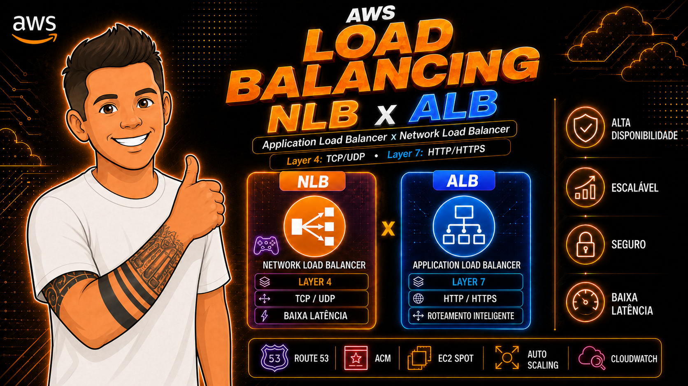
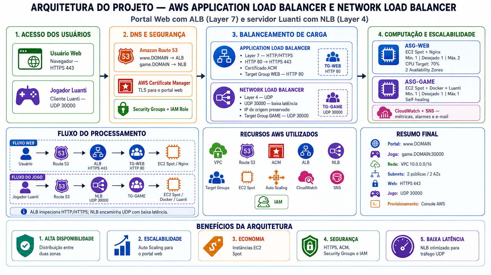
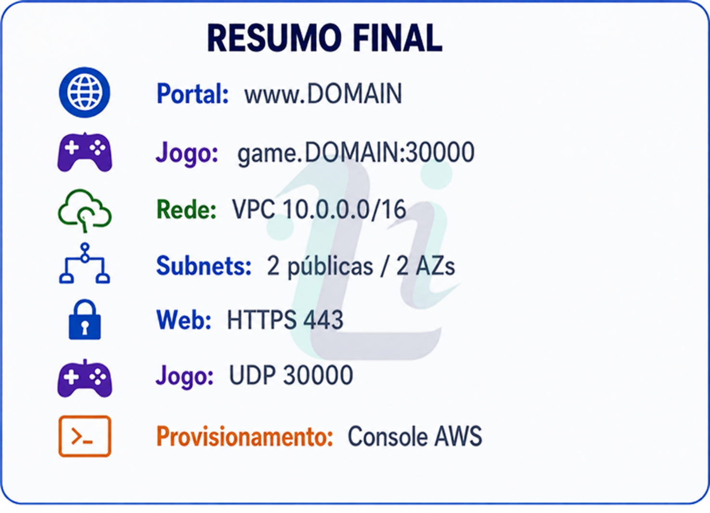
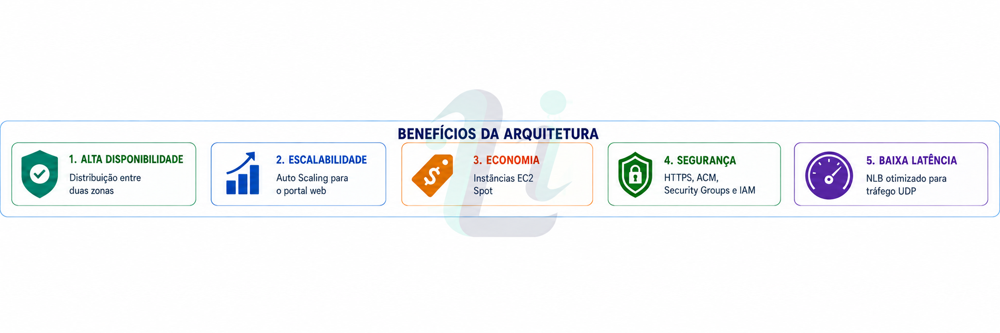
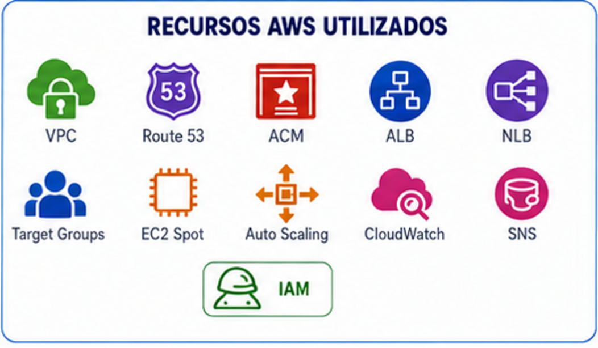
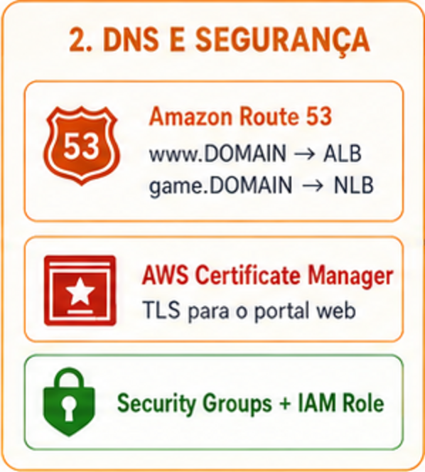
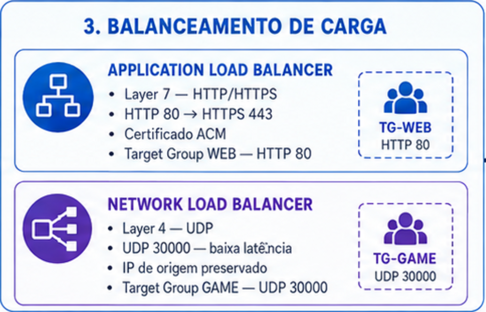
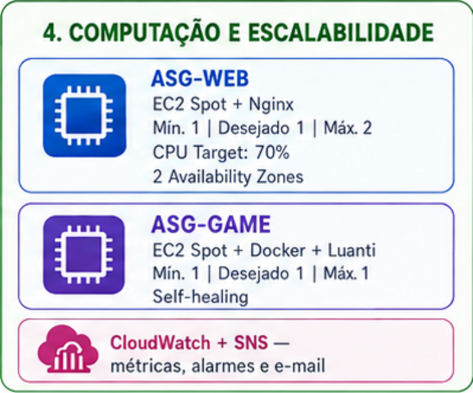
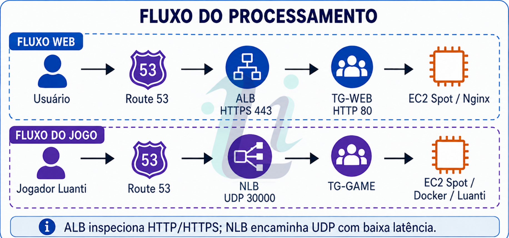

# AWS Load Balancing ALB/NLB - GAME Luanti



## Descrição do Projeto

Este projeto demonstra uma arquitetura completa na Amazon Web Services (AWS) para fins de estudo, laboratório e portfólio profissional. O objetivo principal é ilustrar as diferenças práticas entre Application Load Balancer (ALB) e Network Load Balancer (NLB), utilizando EC2 Spot Instances, Auto Scaling Groups, Target Groups e os conceitos fundamentais de balanceamento de carga nas camadas Layer 7 (HTTP/HTTPS) e Layer 4 (TCP/UDP).

A arquitetura é composta por dois componentes principais: um portal web informativo acessado via ALB com terminação TLS (HTTPS) e um servidor de jogo Luanti (anteriormente Minetest) acessado via NLB na porta UDP 30000. O portal web exibe informações educacionais sobre os serviços AWS utilizados, enquanto o servidor de jogo permite conexões diretas de jogadores através do protocolo UDP, demonstrando como o NLB opera na Layer 4 sem inspeção de conteúdo.

Toda a infraestrutura é criada manualmente via Console AWS, sem uso de CloudFormation, Terraform, CDK ou qualquer ferramenta de Infrastructure as Code. Esta abordagem didática permite compreender cada recurso individualmente, suas dependências e configurações.

---

## Diagrama de Arquitetura



---

## Resumo da Infraestrutura



| Item | Configuração |
|------|-------------|
| 🌐 Portal Web | `www.<SEU-DOMINIO>` — HTTPS 443 |
| 🎮 Servidor de Jogo | `game.<SEU-DOMINIO>:30000` — UDP |
| 🔗 Rede | VPC 10.0.0.0/16 |
| 🏗️ Subnets | 2 públicas / 2 Availability Zones |
| ⚙️ Provisionamento | Console AWS (manual, sem IaC) |

---

## Benefícios da Arquitetura



| # | Benefício | Descrição |
|---|-----------|-----------|
| 1 | **Alta Disponibilidade** | Distribuição entre duas Availability Zones |
| 2 | **Escalabilidade** | Auto Scaling para o portal web (CPU target 70%) |
| 3 | **Economia** | EC2 Spot Instances com até 70% de desconto |
| 4 | **Segurança** | HTTPS com ACM, Security Groups por referência e IAM de menor privilégio |
| 5 | **Baixa Latência** | NLB otimizado para tráfego UDP do jogo |

---

## Recursos AWS Utilizados



VPC • Route 53 • ACM • ALB • NLB • Target Groups • EC2 Spot • Auto Scaling • CloudWatch • SNS • IAM

### Serviços AWS

| Serviço | Função no Projeto |
|---------|-------------------|
| **VPC** | Rede virtual isolada (10.0.0.0/16) com 2 subnets públicas em AZs distintas, Internet Gateway e Route Table |
| **EC2** | Instâncias de computação que hospedam o portal web (Nginx) e o servidor de jogo (Docker + Luanti) |
| **EC2 Spot Instances** | Instâncias com até 70% de desconto, usando pool diversificado (t3.small, t3a.small, t2.small) para reduzir interrupções |
| **Application Load Balancer (ALB)** | Balanceador Layer 7 que recebe tráfego HTTPS na porta 443, realiza terminação TLS com certificado ACM e distribui para instâncias web |
| **Network Load Balancer (NLB)** | Balanceador Layer 4 que encaminha tráfego UDP na porta 30000 diretamente para o servidor de jogo, sem inspeção de conteúdo |
| **Auto Scaling Groups** | Gerenciam capacidade: ASG-WEB escala de 1 a 2 instâncias com base em CPU (target 70%); ASG-GAME mantém exatamente 1 instância (self-healing) |
| **Target Groups** | Registram instâncias e executam health checks: TG-WEB (HTTP /health) e TG-GAME (TCP porta 8080 via socat) |
| **Route 53** | DNS gerenciado com Alias records apontando `www.dominio` para o ALB e `game.dominio` para o NLB |
| **ACM (Certificate Manager)** | Certificado TLS gratuito com validação DNS, usado pelo ALB para terminação HTTPS |
| **CloudWatch** | Coleta de métricas (CPU, memória, disco), logs de aplicação (Nginx, Docker) e alarmes com thresholds configuráveis |
| **SNS (Simple Notification Service)** | Tópico que recebe alarmes do CloudWatch e envia notificações por email ao operador |
| **IAM** | Roles e políticas de menor privilégio para instâncias EC2 (apenas PutMetricData e PutLogEvents no CloudWatch) |

### Stack da Aplicação

| Tecnologia | Função |
|------------|--------|
| **Nginx** | Servidor web nas instâncias do portal, servindo HTML/CSS/JS com endpoint `/health` para health checks |
| **Docker** | Runtime do container Luanti nas instâncias de jogo (imagem `linuxserver/luanti:latest`) |
| **Luanti (Minetest)** | Servidor de jogo open-source voxel, acessível via UDP na porta 30000 |
| **HTML5 / CSS3 / JavaScript** | Portal web responsivo com informações do projeto e instruções de conexão ao servidor |
| **Bash (User Data)** | Scripts de provisionamento automático executados no boot das instâncias EC2 (instalação de pacotes, deploy, health check) |
| **socat** | Utilitário usado para criar um health check TCP dedicado na porta 8080 que valida se o container Luanti está rodando |

---

## Acesso dos Usuários


| Tipo | Protocolo | Destino |
|------|-----------|---------|
| **Usuário Web** | Navegador → HTTPS 443 | Portal informativo via ALB |
| **Jogador Luanti** | Cliente Luanti → UDP 30000 | Servidor de jogo via NLB |

---

## DNS e Segurança



- **Amazon Route 53** — Resolução DNS com Alias records:
  - `www.DOMAIN` → ALB
  - `game.DOMAIN` → NLB
- **AWS Certificate Manager (ACM)** — Certificado TLS gratuito para terminação HTTPS no ALB
- **Security Groups** — Controle de tráfego entre camadas (referência por SG ID)
- **IAM Roles** — Menor privilégio para instâncias EC2 (apenas CloudWatch Logs e Metrics)

---

## Balanceamento de Carga



### Application Load Balancer (ALB)

- Layer 7 — HTTP/HTTPS
- Redirect HTTP 80 → HTTPS 443
- Certificado ACM para terminação TLS
- Target Group WEB — HTTP 80, health check `GET /health`

### Network Load Balancer (NLB)

- Layer 4 — UDP
- UDP 30000 — passthrough com baixa latência
- IP de origem do jogador preservado
- Target Group GAME — UDP 30000, health check TCP 8080 (Override)

### Comparação ALB vs NLB

| Critério | ALB | NLB |
|----------|-----|-----|
| Camada OSI | Layer 7 (Aplicação) | Layer 4 (Transporte) |
| Protocolos | HTTP, HTTPS, gRPC | TCP, UDP, TLS |
| Terminação TLS | Sim, no próprio load balancer | Opcional (TLS passthrough) |
| Preservação de IP | Não (usa X-Forwarded-For) | Sim, IP original preservado |
| Caso de uso | Portal web HTTPS + redirect | Servidor de jogo UDP 30000 |
| Roteamento | Baseado em conteúdo (path, host) | Baseado em conexão (IP + porta) |
| Latência | Maior (inspeção HTTP) | Ultra-baixa (passthrough) |
| Health Check | HTTP/HTTPS com path | TCP porta Override para UDP |

---

## Computação e Escalabilidade



### ASG-WEB (Portal)

- EC2 Spot + Nginx
- Mín. 1 | Desejado 1 | Máx. 2
- CPU Target Tracking: 70%
- 2 Availability Zones
- Tipos: t3.small, t3a.small, t2.small

### ASG-GAME (Servidor de Jogo)

- EC2 Spot + Docker + Luanti
- Mín. 1 | Desejado 1 | Máx. 1
- Self-healing (substitui instância automaticamente se falhar)

### Monitoramento

- **CloudWatch** — Métricas (CPU, memória, disco), logs centralizados
- **SNS** — Alarmes por email ao operador

---

## Fluxo do Processamento



### Fluxo Web

```
Usuário → Route 53 → ALB (HTTPS 443) → TG-WEB (HTTP 80) → EC2 Spot / Nginx
```

### Fluxo do Jogo

```
Jogador → Route 53 → NLB (UDP 30000) → TG-GAME → EC2 Spot / Docker / Luanti
```

> O ALB inspeciona HTTP/HTTPS (Layer 7); o NLB encaminha UDP com baixa latência (Layer 4).

---

## Conceitos Demonstrados

- Diferença prática entre balanceamento Layer 4 (NLB/UDP) e Layer 7 (ALB/HTTPS)
- Terminação TLS no load balancer com certificado ACM gratuito
- Health checks customizados (HTTP path vs TCP port override para UDP)
- Spot Instances com diversificação de pool e self-healing via Auto Scaling
- Segurança com Security Groups referenciados por ID (sem abrir portas desnecessárias)
- IAM com menor privilégio (roles específicas por função)
- Observabilidade com CloudWatch Agent (métricas custom + logs centralizados)
- Provisionamento imutável via User Data (instâncias descartáveis e reproduzíveis)

---

## Estrutura de Diretórios

| Diretório | Descrição |
|-----------|-----------|
| `web/` | Portal web informativo com HTML, CSS, JavaScript e configuração Nginx |
| `game/` | Configuração Docker do servidor Luanti (Dockerfile, docker-compose, configs) |
| `scripts/` | Scripts de User Data para provisionamento EC2 e utilitários de validação AWS CLI |
| `imagens/` | Imagens dos diagramas de arquitetura do projeto |

---

