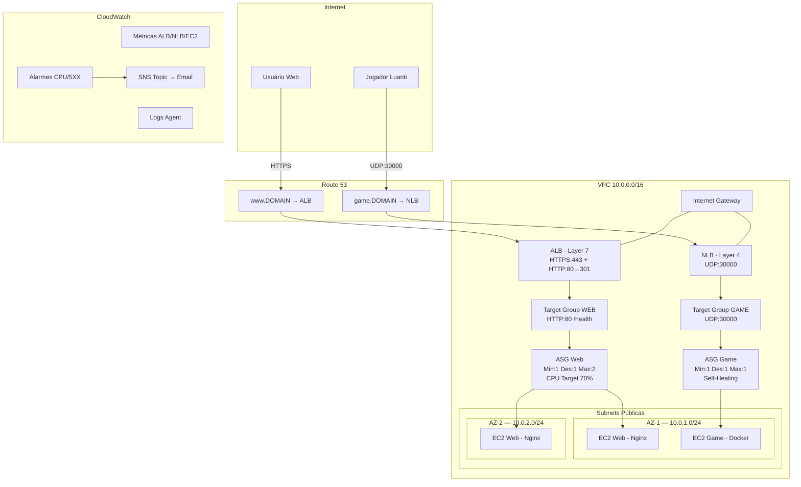

# AWS Luanti ALB/NLB — Arquitetura de Load Balancing na AWS

## Descrição do Projeto

Este projeto demonstra uma arquitetura completa na Amazon Web Services (AWS) para fins de estudo, laboratório e portfólio profissional. O objetivo principal é ilustrar as diferenças práticas entre Application Load Balancer (ALB) e Network Load Balancer (NLB), utilizando EC2 Spot Instances, Auto Scaling Groups, Target Groups e os conceitos fundamentais de balanceamento de carga nas camadas Layer 7 (HTTP/HTTPS) e Layer 4 (TCP/UDP).

A arquitetura é composta por dois componentes principais: um portal web informativo acessado via ALB com terminação TLS (HTTPS) e um servidor de jogo Luanti (anteriormente Minetest) acessado via NLB na porta UDP 30000. O portal web exibe informações educacionais sobre os serviços AWS utilizados, enquanto o servidor de jogo permite conexões diretas de jogadores através do protocolo UDP, demonstrando como o NLB opera na Layer 4 sem inspeção de conteúdo.

Toda a infraestrutura é criada manualmente via Console AWS, sem uso de CloudFormation, Terraform, CDK ou qualquer ferramenta de Infrastructure as Code. Esta abordagem didática permite compreender cada recurso individualmente, suas dependências e configurações. O repositório contém o código da aplicação web, configuração Docker do servidor de jogo, scripts de User Data para provisionamento automático, diagramas de arquitetura e guias completos de implantação passo a passo.

---

## Índice de Documentação

| Documento | Descrição |
|-----------|-----------|
| [ARQUITETURA.md](ARQUITETURA.md) | Diagramas detalhados da arquitetura (topologia, tráfego, segurança, Auto Scaling, monitoramento) |
| [IMPLANTACAO-AWS.md](IMPLANTACAO-AWS.md) | Guia passo a passo para criação manual de todos os recursos via Console AWS (13 blocos) |
| [SPOT-AUTOSCALING.md](SPOT-AUTOSCALING.md) | Estratégia Spot, política de Auto Scaling, tratamento de interrupção e métricas |
| [docs/ALB.md](docs/ALB.md) | Documentação técnica sobre Application Load Balancer |
| [docs/NLB.md](docs/NLB.md) | Documentação técnica sobre Network Load Balancer |
| [docs/REDE.md](docs/REDE.md) | Documentação técnica sobre VPC e rede |
| [docs/SEGURANCA.md](docs/SEGURANCA.md) | Documentação técnica sobre Security Groups e IAM |
| [docs/MONITORAMENTO.md](docs/MONITORAMENTO.md) | Documentação técnica sobre CloudWatch e observabilidade |
| [docs/TROUBLESHOOTING.md](docs/TROUBLESHOOTING.md) | Guia de resolução de problemas comuns |

---

## Estrutura de Diretórios

| Diretório | Descrição |
|-----------|-----------|
| `web/` | Portal web informativo com HTML, CSS, JavaScript e configuração Nginx |
| `game/` | Configuração Docker do servidor Luanti (Dockerfile, docker-compose, configs) |
| `scripts/` | Scripts de User Data para provisionamento EC2 e utilitários de validação AWS CLI |
| `docs/` | Documentação técnica separada por tema (ALB, NLB, rede, segurança, monitoramento, troubleshooting) |
| `diagrams/` | Diagramas de arquitetura em formato Mermaid e imagens exportadas |

---

## Comparação ALB vs NLB

| Critério | ALB (Application Load Balancer) | NLB (Network Load Balancer) |
|----------|--------------------------------|----------------------------|
| Camada OSI | Layer 7 (Aplicação) | Layer 4 (Transporte) |
| Protocolos | HTTP, HTTPS, gRPC | TCP, UDP, TLS |
| Terminação TLS | Sim, no próprio load balancer | Opcional (TLS passthrough disponível) |
| Preservação de IP do cliente | Não (usa X-Forwarded-For header) | Sim, IP original preservado nativamente |
| Caso de uso neste projeto | Portal web com HTTPS e redirect HTTP→HTTPS | Servidor de jogo Luanti via UDP porta 30000 |
| Roteamento | Baseado em conteúdo (path, host, headers) | Baseado em conexão (IP + porta) |
| Latência | Maior (inspeção de conteúdo HTTP) | Ultra-baixa (passthrough sem inspeção) |
| Health Check | HTTP/HTTPS com path customizado | TCP, HTTP ou HTTPS |

---

## Diagrama de Arquitetura



---

## Instruções de Uso

### Pré-requisitos

- Conta AWS ativa com permissões administrativas
- AWS CLI instalada e configurada localmente (`aws configure`)
- Domínio registrado com Hosted Zone no Route 53
- Certificado ACM validado para o domínio (validação DNS)
- Git instalado para clonar o repositório

### Implantação

1. **Clone o repositório:**
   ```bash
   git clone https://github.com/seu-usuario/AWS-Luanti-NLB-ALB.git
   cd AWS-Luanti-NLB-ALB
   ```

2. **Configure as variáveis de ambiente:**
   ```bash
   cp .env.example .env
   # Edite .env com seus valores reais (região, domínio, conta AWS, etc.)
   ```

3. **Siga o guia de implantação:**
   - Abra [IMPLANTACAO-AWS.md](IMPLANTACAO-AWS.md) e execute os 13 blocos sequencialmente no Console AWS
   - Cada bloco contém instruções detalhadas, valores a preencher e checkpoints de validação

4. **Execute os scripts de User Data:**
   - Os scripts em `scripts/user-data-web.sh` e `scripts/user-data-game.sh` são colados no campo User Data dos Launch Templates durante a criação no Console

### Validação

1. **Execute o script de validação:**
   ```bash
   chmod +x scripts/validate-resources.sh
   ./scripts/validate-resources.sh
   ```

2. **Teste o portal web:**
   ```bash
   curl -I https://www.SEU-DOMINIO
   # Esperado: HTTP/2 200
   ```

3. **Teste o redirect HTTP→HTTPS:**
   ```bash
   curl -I http://www.SEU-DOMINIO
   # Esperado: HTTP/1.1 301 Moved Permanently
   ```

4. **Teste a resolução DNS:**
   ```bash
   nslookup www.SEU-DOMINIO
   nslookup game.SEU-DOMINIO
   ```

5. **Teste o servidor de jogo:**
   - Abra o cliente Luanti e conecte em `game.SEU-DOMINIO:30000`

---

## Custos Estimados

| Recurso | Tipo | Custo On-Demand (mensal) | Custo Spot (mensal) | Economia |
|---------|------|--------------------------|---------------------|----------|
| EC2 Web (t3.small) | Instância | ~$15.18 | ~$4.55 | ~70% |
| EC2 Game (t3.small) | Instância | ~$15.18 | ~$4.55 | ~70% |
| ALB | Load Balancer | ~$16.43 | — | — |
| NLB | Load Balancer | ~$16.43 | — | — |
| Route 53 | DNS | ~$0.50 | — | — |
| ACM | Certificado | Gratuito | — | — |
| CloudWatch | Monitoramento | ~$3.00 | — | — |
| SNS | Notificações | ~$0.00 | — | — |
| **Total Estimado** | | **~$66.72** | **~$45.46** | **~32%** |

> **Nota:** Os valores são estimativas baseadas na região us-east-1 com uso moderado. O custo real pode variar conforme a região, volume de tráfego e disponibilidade de capacidade Spot. A economia com Spot Instances pode chegar a 70-90% em instâncias individuais, mas o total do projeto inclui recursos com preço fixo (ALB, NLB, Route 53).

---

## Tecnologias Utilizadas

- **AWS:** VPC, EC2, ALB, NLB, Auto Scaling, Route 53, ACM, CloudWatch, SNS, IAM
- **Web:** HTML5, CSS3, JavaScript, Nginx
- **Game:** Docker, Luanti (Minetest)
- **Scripts:** Bash (User Data, validação)
- **Documentação:** Markdown, Mermaid (diagramas)

---

## Licença

Este projeto é de uso educacional e para fins de portfólio.
