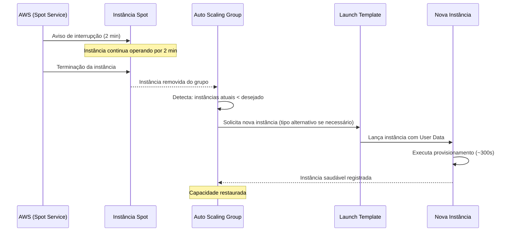

# Spot Instances e Auto Scaling

Este documento detalha a estratégia de utilização de EC2 Spot Instances e Auto Scaling Groups no projeto AWS Luanti ALB/NLB. O objetivo é demonstrar como reduzir custos de infraestrutura em até 70% em relação a instâncias On-Demand, mantendo alta disponibilidade através de diversificação de tipos de instância, políticas de escalabilidade automática e mecanismos de self-healing.

---

## Índice

1. [Estratégia de Alocação Spot](#estratégia-de-alocação-spot)
2. [Política de Auto Scaling](#política-de-auto-scaling)
3. [Tratamento de Interrupção de Spot Instances](#tratamento-de-interrupção-de-spot-instances)
4. [Métricas de Monitoramento](#métricas-de-monitoramento)

---

## Estratégia de Alocação Spot

### Conceito de Spot Instances

EC2 Spot Instances são instâncias computacionais oferecidas pela AWS a preços significativamente reduzidos em comparação com instâncias On-Demand. A economia típica varia entre 60% e 90%, dependendo do tipo de instância, região e disponibilidade de capacidade. Neste projeto, a economia estimada é de aproximadamente 70%. A contrapartida é que a AWS pode reclamar (interromper) essas instâncias com um aviso prévio de 2 minutos quando a capacidade excedente é necessária para atender demanda On-Demand.

### Diversificação de Tipos de Instância

Para minimizar o risco de interrupção simultânea de todas as instâncias, o projeto utiliza uma estratégia de diversificação com múltiplos tipos de instância nos Launch Templates. Cada Launch Template está configurado para aceitar os seguintes tipos:

| Tipo de Instância | vCPUs | Memória | Família | Geração |
|-------------------|-------|---------|---------|---------|
| t3.small          | 2     | 2 GiB   | T3      | Nitro   |
| t3a.small         | 2     | 2 GiB   | T3a     | Nitro (AMD) |
| t2.small          | 1     | 2 GiB   | T2      | Anterior |

A diversificação entre famílias de instância (T3, T3a e T2) e gerações diferentes de hardware reduz drasticamente a probabilidade de interrupção simultânea. Cada pool de capacidade Spot (combinação de tipo de instância + Availability Zone) é independente, o que significa que a interrupção em um pool não afeta a disponibilidade nos demais.

### Configuração nos Launch Templates

Os Launch Templates `LaunchTemplate-WEB` e `LaunchTemplate-GAME` estão configurados com as seguintes opções Spot:

- **Market Type**: Spot
- **Spot Instance Type**: one-time (requisição única)
- **Instance Types**: t3.small, t3a.small, t2.small (configurados no ASG via Mixed Instances Policy)
- **InterruptionBehavior**: terminate (a instância é encerrada ao ser reclamada)

A estratégia de alocação `capacity-optimized` é recomendada para os Auto Scaling Groups, pois a AWS aloca instâncias nos pools com maior disponibilidade de capacidade, reduzindo a frequência de interrupções.

### Benefícios da Estratégia

- **Maior disponibilidade**: pools diversificados garantem que pelo menos um tipo de instância esteja disponível na região
- **Economia consistente**: mesmo com variações de preço entre tipos, todos oferecem descontos significativos
- **Resiliência**: a interrupção de um tipo específico não compromete o serviço, pois o ASG pode provisionar outro tipo imediatamente
- **Simplicidade**: a carga de trabalho deste projeto (Nginx e Docker) é compatível com todos os tipos configurados sem necessidade de ajustes

---

## Política de Auto Scaling

### ASG_WEB — Escalabilidade por Demanda

O Auto Scaling Group responsável pelo Portal Web (`ASG_WEB`) está configurado para escalar automaticamente com base na utilização de CPU, garantindo que o serviço web mantenha performance adequada sob variações de tráfego.

#### Configuração de Capacidade

| Parâmetro | Valor | Justificativa |
|-----------|-------|---------------|
| Capacidade Mínima | 1 | Garante pelo menos uma instância ativa em todo momento |
| Capacidade Desejada | 1 | Operação normal com uma instância atendendo tráfego |
| Capacidade Máxima | 2 | Permite escalar para absorver picos de tráfego |

#### Target Tracking Scaling Policy

A política de escalabilidade do tipo Target Tracking monitora a métrica `CPUUtilization` e ajusta automaticamente a quantidade de instâncias para manter a utilização média de CPU próxima ao valor alvo definido.

| Parâmetro | Valor | Descrição |
|-----------|-------|-----------|
| Métrica alvo | CPUUtilization | Utilização média de CPU do grupo |
| Threshold (valor alvo) | 70% | Percentual de CPU a ser mantido como meta |
| Cooldown de scale-out | 300 segundos | Tempo mínimo entre ações de adição de instâncias |
| Cooldown de scale-in | 300 segundos | Tempo mínimo entre ações de remoção de instâncias |

**Comportamento de scale-out**: quando a utilização média de CPU do ASG ultrapassa 70% por tempo suficiente para ativar a política, o ASG adiciona uma instância (até o máximo de 2). O cooldown de 300 segundos impede reações excessivas a picos momentâneos de CPU.

**Comportamento de scale-in**: quando a carga diminui e a CPU média cai significativamente abaixo de 70%, o ASG remove instâncias excedentes (até o mínimo de 1). O cooldown protege contra oscilações rápidas que causariam instabilidade.

#### Por que 70% como threshold?

O valor de 70% foi escolhido como equilíbrio entre performance e economia:

- Valores muito baixos (ex: 40%) causam scale-out frequente e custos desnecessários
- Valores muito altos (ex: 90%) podem não deixar margem para absorver picos antes de degradação
- 70% permite headroom suficiente para lidar com variações enquanto aciona scaling antes de saturação

### ASG_GAME — Self-Healing

O Auto Scaling Group do servidor de jogo (`ASG_GAME`) opera em modo de self-healing, sem escalabilidade dinâmica. Sua função é manter exatamente uma instância saudável em operação contínua.

#### Configuração de Capacidade

| Parâmetro | Valor | Justificativa |
|-----------|-------|---------------|
| Capacidade Mínima | 1 | Sempre deve haver um servidor de jogo |
| Capacidade Desejada | 1 | Apenas um servidor ativo por vez |
| Capacidade Máxima | 1 | Sem escalabilidade horizontal (estado do mundo não é compartilhável) |

#### Mecanismo de Self-Healing

Com mínima = desejada = máxima = 1, o ASG funciona exclusivamente como mecanismo de recuperação automática:

1. Se a instância falhar (crash, Spot interrompida, health check falhando), o ASG detecta que a contagem de instâncias saudáveis está abaixo do desejado
2. O ASG automaticamente lança uma nova instância usando o Launch Template configurado
3. A nova instância executa o User Data, que provisiona o servidor de jogo em até 300 segundos
4. O Target Group registra a nova instância após o health check confirmar saúde

#### Health Check Configuração

| Parâmetro | Valor | Descrição |
|-----------|-------|-----------|
| Tipo de Health Check | ELB | Baseado no health check do Target Group associado |
| Grace Period | 300 segundos | Tempo concedido para provisionamento via User Data antes de verificar saúde |

A configuração de health check tipo ELB é superior ao health check EC2 padrão porque detecta não apenas falhas da instância, mas também falhas da aplicação (container Docker não respondendo na porta UDP 30000).

### Configuração de Availability Zones

Ambos os ASGs utilizam no mínimo 2 Availability Zones distintas para distribuição de instâncias. Isso garante que, caso uma AZ tenha problemas de capacidade Spot ou sofra degradação, o ASG pode provisionar instâncias na AZ alternativa sem interrupção do serviço.

---

## Tratamento de Interrupção de Spot Instances

### O que é uma Interrupção Spot?

Uma interrupção Spot ocorre quando a AWS precisa reclamar a capacidade excedente que foi alocada como Spot Instance. Isso pode acontecer por três motivos:

1. **Capacidade**: a AWS precisa da capacidade para instâncias On-Demand ou Reserved
2. **Preço**: o preço Spot excedeu o preço máximo definido (quando especificado)
3. **Restrições**: a instância não atende mais aos requisitos de capacidade

Quando uma interrupção é iniciada, a AWS envia um aviso de 2 minutos (Spot Instance Interruption Notice) antes de encerrar a instância.

### Comportamento Configurado: InterruptionBehavior = terminate

Neste projeto, o `InterruptionBehavior` está configurado como `terminate` em ambos os Launch Templates. Isso significa que quando a AWS reclama a capacidade, a instância Spot é **terminada** (destruída), e não apenas parada ou hibernada.

#### Por que terminate?

| Comportamento | Descrição | Adequação ao Projeto |
|---------------|-----------|---------------------|
| **terminate** | Instância é encerrada e removida | ✅ Ideal — ASG detecta e repõe automaticamente |
| stop | Instância é parada (pode ser reiniciada) | ❌ Inadequado — ASG não repõe instâncias paradas |
| hibernate | Instância é hibernada (estado salvo) | ❌ Inadequado — complexidade desnecessária |

A escolha de `terminate` é a mais adequada para este projeto porque:

- O ASG monitora a contagem de instâncias e detecta imediatamente quando uma é terminada
- Uma nova instância é automaticamente provisionada para repor a capacidade
- O User Data garante que a nova instância será configurada identicamente
- Não há dados persistentes que precisem ser preservados (o mundo do jogo é efêmero)

### Fluxo de Recuperação Após Interrupção

### Tempo de Recuperação Estimado

| Fase | Duração Estimada | Descrição |
|------|-----------------|-----------|
| Detecção pelo ASG | 10–30 segundos | ASG identifica que instância foi terminada |
| Solicitação de nova instância | 10–60 segundos | AWS provisiona nova instância Spot (tipo disponível) |
| Boot da instância | 30–60 segundos | Inicialização do sistema operacional |
| Execução do User Data | 60–180 segundos | Instalação de pacotes e configuração |
| Health check grace period | Até 300 segundos | Tempo antes de verificar saúde da instância |
| **Total máximo** | **~5 minutos** | Tempo até a instância estar servindo tráfego |

### Mitigação de Risco

A estratégia do projeto para minimizar o impacto de interrupções inclui:

1. **Diversificação de tipos**: com 3 tipos de instância em 2 AZs, há 6 pools Spot independentes disponíveis
2. **ASG reposição automática**: sem intervenção manual necessária
3. **Stateless design**: tanto o portal web quanto o servidor de jogo podem ser reconstruídos do zero via User Data
4. **Grace period adequado**: 300 segundos permitem provisionamento completo antes de receber tráfego

---

## Métricas de Monitoramento

### Visão Geral

O monitoramento das Spot Instances e Auto Scaling Groups é realizado através do Amazon CloudWatch, que coleta métricas em tempo real, permite configuração de alarmes e fornece visibilidade sobre a saúde e performance da infraestrutura. As métricas são coletadas com período de 60 segundos.

### Métricas Principais

#### CPUUtilization

| Propriedade | Valor |
|-------------|-------|
| Namespace | AWS/EC2 |
| Período | 60 segundos |
| Estatística | Average |
| Dimensão | AutoScalingGroupName |
| Threshold de alarme | > 80% por 3 datapoints consecutivos |
| Ação | Publicar notificação em tópico SNS |

A métrica `CPUUtilization` é a mais importante para o ASG_WEB, pois alimenta diretamente a política de Target Tracking Scaling. Quando a média do grupo atinge 70%, o scale-out é acionado. O alarme independente em 80% serve como notificação ao operador de que a carga está elevada, mesmo que o scaling já esteja atuando.

Para o ASG_GAME, a métrica de CPU indica se o servidor de jogo está sob carga excessiva, o que pode afetar a experiência dos jogadores. Como não há scale-out para o servidor de jogo (max=1), o alarme serve como alerta para possível degradação de performance.

#### ActiveInstances (GroupInServiceInstances)

| Propriedade | Valor |
|-------------|-------|
| Namespace | AWS/AutoScaling |
| Período | 60 segundos |
| Estatística | Average |
| Dimensão | AutoScalingGroupName |
| Threshold de alarme (ASG_WEB) | < 1 por 1 datapoint |
| Threshold de alarme (ASG_GAME) | < 1 por 1 datapoint |
| Ação | Publicar notificação em tópico SNS |

A métrica `GroupInServiceInstances` indica quantas instâncias estão atualmente em serviço no Auto Scaling Group. Um valor abaixo do desejado indica que o ASG está em processo de recuperação (possivelmente após uma interrupção Spot) ou que há falha em provisionar novas instâncias.

Este alarme é crítico para detectar situações onde:

- Uma interrupção Spot ocorreu e a reposição está em andamento
- Não há capacidade Spot disponível em nenhum dos tipos configurados
- O User Data está falhando e instâncias não passam no health check

#### SpotInterruptionRate

| Propriedade | Valor |
|-------------|-------|
| Namespace | AWS/EC2Spot (métrica customizada) |
| Período | 300 segundos (5 minutos) |
| Estatística | Sum |
| Dimensão | AutoScalingGroupName |
| Threshold de alarme | > 2 interrupções em 1 hora |
| Ação | Publicar notificação em tópico SNS |

A taxa de interrupção de Spot Instances não é uma métrica nativa do CloudWatch padrão. Para monitorá-la, o projeto documenta duas abordagens:

**Abordagem 1 — CloudWatch Events / EventBridge:**
Configurar uma regra EventBridge que capture eventos do tipo `EC2 Spot Instance Interruption Warning` e publique em um tópico SNS. Adicionalmente, uma métrica customizada pode ser incrementada a cada evento para acompanhamento histórico.

**Abordagem 2 — Monitoramento via ASG Activities:**
Acompanhar as atividades do ASG (`describe-scaling-activities`) para identificar terminações causadas por interrupções Spot. A frequência de atividades de substituição é um proxy para a taxa de interrupção.

### Dashboard Recomendado

Para visualização consolidada, recomenda-se criar um dashboard CloudWatch com os seguintes widgets:

| Widget | Tipo | Métricas |
|--------|------|----------|
| CPU por ASG | Gráfico de linha | CPUUtilization (ASG_WEB, ASG_GAME) |
| Instâncias em serviço | Número | GroupInServiceInstances (ambos ASGs) |
| Atividades de scaling | Gráfico de linha | GroupTotalInstances, GroupTerminatingInstances |
| Alarmes ativos | Status | Todos os alarmes do projeto |
| Custo Spot vs On-Demand | Número | Savings estimado (métrica customizada) |

### Alarmes Configurados

| Nome do Alarme | Métrica | Condição | Período | Ação |
|----------------|---------|----------|---------|------|
| HighCPU-ASG-WEB | CPUUtilization | > 80% | 3× 60s | SNS |
| HighCPU-ASG-GAME | CPUUtilization | > 80% | 3× 60s | SNS |
| NoInstances-ASG-WEB | GroupInServiceInstances | < 1 | 1× 60s | SNS |
| NoInstances-ASG-GAME | GroupInServiceInstances | < 1 | 1× 60s | SNS |
| SpotInterruptions-High | Customizada | > 2/hora | 1× 300s | SNS |

### Integração com SNS

Todos os alarmes publicam notificações em um tópico SNS (`AWS-Luanti-NLB-ALB-Lab-Alerts`), que distribui alertas por email ao operador. As notificações incluem:

- Nome do alarme acionado
- Métrica e valor que disparou o alarme
- Timestamp do evento
- Identificação do recurso afetado (ASG, instância)

Essa abordagem centralizada permite que o operador seja notificado rapidamente sobre qualquer degradação na infraestrutura, seja por interrupções Spot, falhas de aplicação ou sobrecarga de recursos.

---

## Referências

- [IMPLANTACAO-AWS.md](IMPLANTACAO-AWS.md) — Guia completo de criação dos recursos via Console AWS
- [ARQUITETURA.md](ARQUITETURA.md) — Diagramas detalhados da arquitetura
- [docs/MONITORAMENTO.md](docs/MONITORAMENTO.md) — Documentação técnica sobre CloudWatch
- [docs/TROUBLESHOOTING.md](docs/TROUBLESHOOTING.md) — Guia de resolução de problemas

---

**Tags aplicadas aos recursos**: `Project=AWS-Luanti-NLB-ALB`, `Environment=Lab`
