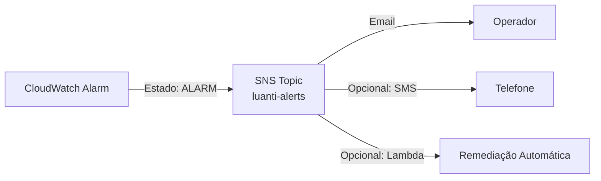

# Monitoramento com CloudWatch

## Conceitos Fundamentais — Observabilidade na AWS

O **Amazon CloudWatch** é o serviço nativo de monitoramento e observabilidade da AWS. Ele centraliza a coleta de métricas, criação de alarmes, armazenamento de logs e envio de notificações em uma única plataforma integrada. Para arquiteturas com Load Balancers, Auto Scaling Groups e instâncias EC2, o CloudWatch fornece visibilidade completa sobre o desempenho, saúde e comportamento dos componentes.

O modelo de monitoramento do CloudWatch se baseia em três pilares:

- **Métricas**: Dados numéricos coletados automaticamente dos serviços AWS (e opcionalmente de aplicações) em intervalos regulares. Cada métrica pertence a um namespace (ex: `AWS/EC2`, `AWS/ApplicationELB`) e possui dimensões que permitem filtrar por recurso específico.
- **Alarmes**: Regras que avaliam métricas contra thresholds definidos e executam ações automáticas quando a condição é violada. Os alarmes possuem três estados: OK, ALARM e INSUFFICIENT_DATA.
- **Logs**: Registros textuais de eventos coletados das instâncias e serviços, armazenados em Log Groups com retenção configurável.

A integração entre esses pilares permite criar pipelines de observabilidade: uma métrica dispara um alarme, que publica em um tópico SNS, que notifica a equipe operacional por email.

## Métricas CloudWatch

### Métricas do ALB (Namespace: AWS/ApplicationELB)

| Métrica | Descrição | Período |
|---------|-----------|---------|
| RequestCount | Número total de requisições processadas | 60s |
| TargetResponseTime | Tempo médio de resposta dos targets (em segundos) | 60s |
| HTTPCode_ELB_5XX | Quantidade de respostas 5XX geradas pelo próprio ALB | 60s |
| HTTPCode_Target_2XX | Respostas 2XX retornadas pelos targets | 60s |
| HealthyHostCount | Número de targets saudáveis no Target Group | 60s |
| UnHealthyHostCount | Número de targets não saudáveis no Target Group | 60s |

### Métricas do NLB (Namespace: AWS/NetworkELB)

| Métrica | Descrição | Período |
|---------|-----------|---------|
| ProcessedBytes | Volume total de bytes processados pelo NLB | 60s |
| ActiveFlowCount | Número de fluxos (conexões) ativos simultaneamente | 60s |
| NewFlowCount | Novos fluxos estabelecidos no período | 60s |
| HealthyHostCount | Targets saudáveis no Target Group GAME | 60s |

### Métricas do EC2 (Namespace: AWS/EC2)

| Métrica | Descrição | Período |
|---------|-----------|---------|
| CPUUtilization | Percentual de uso da CPU da instância | 60s |
| NetworkIn | Bytes recebidos pela interface de rede | 60s |
| NetworkOut | Bytes enviados pela interface de rede | 60s |
| DiskReadOps | Operações de leitura em disco no período | 60s |
| DiskWriteOps | Operações de escrita em disco no período | 60s |

As métricas de EC2 com período de 60 segundos estão disponíveis por padrão para instâncias com **detailed monitoring** habilitado. O monitoramento básico (padrão) coleta a cada 5 minutos.

## Alarmes CloudWatch

Os alarmes monitoram métricas continuamente e disparam ações quando um threshold é violado. A configuração de um alarme exige:

- **Métrica**: qual dado observar
- **Statistic**: como agregar os datapoints (Average, Sum, Maximum, etc.)
- **Period**: intervalo de agregação (em segundos)
- **Evaluation Periods / Datapoints to Alarm**: quantos períodos consecutivos devem violar o threshold antes de disparar
- **Threshold**: valor limite que define a condição de alarme
- **Comparison Operator**: operador de comparação (GreaterThanThreshold, LessThanThreshold, etc.)
- **Actions**: o que executar quando o alarme muda de estado (ex: publicar em tópico SNS)

### Alarmes Configurados no Projeto

#### Alarme de CPU Alta

| Parâmetro | Valor |
|-----------|-------|
| Nome | luanti-cpu-high |
| Namespace | AWS/EC2 |
| Métrica | CPUUtilization |
| Statistic | Average |
| Period | 60 segundos |
| Evaluation Periods | 3 |
| Datapoints to Alarm | 3 de 3 |
| Threshold | > 80% |
| Comparison | GreaterThanThreshold |
| Ação (ALARM) | Publicar no SNS Topic |

Este alarme indica que as instâncias EC2 estão sob carga elevada por pelo menos 3 minutos consecutivos. Em conjunto com a Target Tracking Policy do ASG_WEB (threshold CPU 70%), este alarme funciona como uma segunda camada de alerta quando o Auto Scaling não é suficiente para normalizar a carga.

#### Alarme de Erros 5XX no ALB

| Parâmetro | Valor |
|-----------|-------|
| Nome | luanti-alb-5xx |
| Namespace | AWS/ApplicationELB |
| Métrica | HTTPCode_ELB_5XX |
| Statistic | Sum |
| Period | 300 segundos (5 minutos) |
| Evaluation Periods | 1 |
| Datapoints to Alarm | 1 de 1 |
| Threshold | > 10 |
| Comparison | GreaterThanThreshold |
| Ação (ALARM) | Publicar no SNS Topic |

Erros 5XX gerados pelo ALB indicam problemas sérios: todos os targets estão indisponíveis, o Target Group está vazio, ou há erros internos no balanceador. Um pico de mais de 10 erros em 5 minutos requer investigação imediata.

## Coleta de Logs — CloudWatch Agent

O **CloudWatch Agent** é instalado nas instâncias EC2 via User Data e é responsável por enviar logs do sistema operacional e da aplicação para o CloudWatch Logs. O Agent é configurado via arquivo JSON que define quais arquivos de log coletar e para qual Log Group enviar.

### Estratégia de Coleta

| Log File | Log Group | Descrição |
|----------|-----------|-----------|
| /var/log/messages | /luanti/system | Logs do sistema operacional (Amazon Linux) |
| Logs de aplicação (Nginx/Docker) | /luanti/application | Logs de acesso e erro do Nginx ou stdout do container |

### Configuração dos Log Groups

| Parâmetro | Valor |
|-----------|-------|
| Retenção | 7 dias |
| Classe | Standard |
| Encryption | Default (AWS managed key) |

A retenção de 7 dias é adequada para um ambiente de laboratório, mantendo os custos baixos. Em produção, recomenda-se 30 a 90 dias ou exportação para S3 para retenção de longo prazo.

### Permissões IAM Necessárias

O CloudWatch Agent requer permissões específicas na IAM Role associada às instâncias:

```json
{
  "Version": "2012-10-17",
  "Statement": [
    {
      "Effect": "Allow",
      "Action": [
        "cloudwatch:PutMetricData",
        "logs:CreateLogGroup",
        "logs:CreateLogStream",
        "logs:PutLogEvents",
        "logs:DescribeLogStreams"
      ],
      "Resource": "*"
    }
  ]
}
```

Essa política permite ao Agent publicar métricas customizadas e enviar logs para o CloudWatch. Em um cenário de produção, o `Resource` deve ser restrito aos ARNs específicos dos Log Groups utilizados.

## Integração com SNS

O **Amazon Simple Notification Service (SNS)** atua como canal de distribuição das notificações geradas pelos alarmes. Quando um alarme entra no estado ALARM, ele publica uma mensagem no tópico SNS configurado, que então distribui a notificação para todos os subscribers.

### Configuração do SNS no Projeto

| Parâmetro | Valor |
|-----------|-------|
| Topic Name | luanti-alerts |
| Display Name | Luanti Monitoring Alerts |
| Protocol | Email |
| Endpoint | Endereço de email do operador (variável SNS_EMAIL) |

### Fluxo de Notificação



Após criar o tópico SNS e adicionar o subscriber (email), é necessário confirmar a subscription clicando no link recebido no email. Sem essa confirmação, as notificações não são entregues.

### Boas Práticas de Notificação

- **Evitar alarm fatigue**: Configurar thresholds realistas para evitar alarmes frequentes que são ignorados
- **Separar severidades**: Em cenários mais complexos, criar tópicos distintos para alertas críticos e informativos
- **Documentar runbooks**: Para cada alarme, manter procedimento de investigação documentado (ver [Troubleshooting](./TROUBLESHOOTING.md))

## Dashboards (Recomendação)

Embora não seja obrigatório para este projeto de laboratório, é recomendável criar um dashboard CloudWatch consolidando as métricas mais relevantes:

- **Widget 1**: CPUUtilization de todas as instâncias (gráfico de linha)
- **Widget 2**: RequestCount do ALB (gráfico de barras)
- **Widget 3**: HealthyHostCount e UnHealthyHostCount (número)
- **Widget 4**: HTTPCode_ELB_5XX (gráfico de linha com threshold)
- **Widget 5**: ActiveFlowCount do NLB (gráfico de linha)

Um dashboard permite visualizar rapidamente a saúde geral do sistema sem navegar entre múltiplas telas do Console.

## Referências Internas

- [Documentação ALB](./ALB.md) — Métricas específicas do Application Load Balancer
- [Documentação NLB](./NLB.md) — Métricas específicas do Network Load Balancer
- [Documentação de Segurança](./SEGURANCA.md) — Permissões IAM para CloudWatch Agent
- [Guia de Implantação](../IMPLANTACAO-AWS.md) — Blocos 11, 12 e 13 (Alarmes, Logs, SNS)
- [Troubleshooting](./TROUBLESHOOTING.md) — Resolução de problemas detectados via monitoramento
