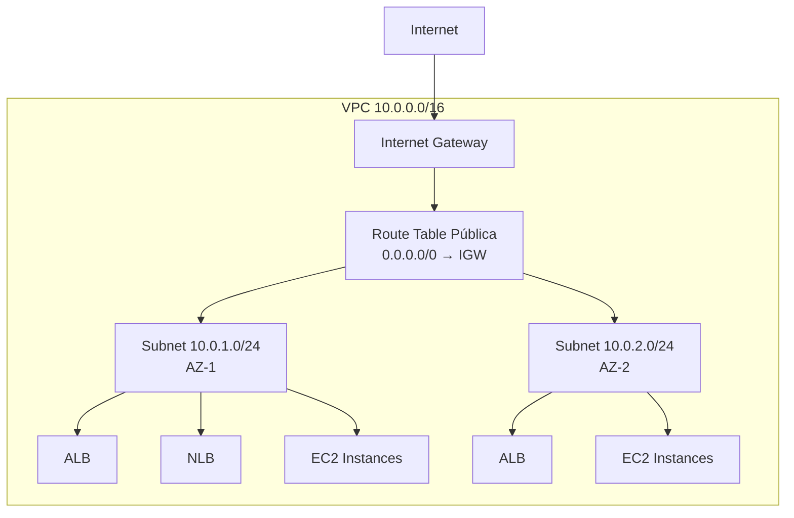

# Documentação Técnica — VPC e Rede

## Visão Geral

Este documento descreve os conceitos de rede utilizados no projeto AWS Luanti ALB/NLB e detalha a configuração de Virtual Private Cloud (VPC) implementada para suportar a infraestrutura de Load Balancers, Auto Scaling Groups e instâncias EC2.

## Conceitos Fundamentais

### Virtual Private Cloud (VPC)

Uma VPC é uma rede virtual isolada dentro da AWS que permite controle total sobre o ambiente de rede. Cada VPC possui um espaço de endereçamento IP privado definido por um bloco CIDR e funciona como a fundação sobre a qual todos os demais recursos de rede são construídos. Recursos criados dentro de uma VPC ficam logicamente isolados de outras VPCs e da internet pública, a menos que rotas e gateways sejam configurados explicitamente.

### CIDR (Classless Inter-Domain Routing)

A notação CIDR define blocos de endereços IP utilizando o formato `endereço/prefixo`. O prefixo indica quantos bits são reservados para a porção de rede. Por exemplo, `10.0.0.0/16` reserva os primeiros 16 bits para a rede, disponibilizando 65.536 endereços IP (2^16) para hosts e subnets. Quanto menor o prefixo, maior o bloco de endereços disponível. A escolha adequada do CIDR é essencial para evitar sobreposição com outras redes e para permitir subdivisão eficiente em subnets.

### Subnets (Sub-redes)

Subnets são subdivisões da VPC que permitem segmentar a rede em blocos menores. Cada subnet reside em uma única Availability Zone e possui seu próprio bloco CIDR, que deve ser um subconjunto do CIDR da VPC. Subnets podem ser classificadas como públicas (com rota para Internet Gateway) ou privadas (sem acesso direto à internet). A distribuição de subnets em múltiplas AZs é fundamental para garantir alta disponibilidade.

### Availability Zones (AZs)

Availability Zones são data centers fisicamente separados dentro de uma região AWS. Cada AZ possui infraestrutura independente de energia, refrigeração e rede, conectadas entre si por links de baixa latência. A distribuição de recursos em múltiplas AZs protege contra falhas de um único data center, garantindo que, se uma AZ ficar indisponível, os recursos na outra AZ continuam operando normalmente.

### Internet Gateway (IGW)

O Internet Gateway é um componente gerenciado pela AWS que permite comunicação bidirecional entre recursos na VPC e a internet pública. Ele atua como ponto de saída e entrada para tráfego IPv4 e IPv6, sendo horizontalmente escalável, redundante e altamente disponível. Sem um IGW associado à VPC, nenhum recurso interno pode acessar a internet diretamente, mesmo que possua IP público.

### Route Tables (Tabelas de Rotas)

Route Tables contêm regras (rotas) que determinam para onde o tráfego de rede é direcionado. Cada subnet deve estar associada a uma Route Table. Uma rota típica para subnets públicas é `0.0.0.0/0 → IGW`, que direciona todo o tráfego com destino externo para o Internet Gateway. A Route Table também inclui automaticamente uma rota local para o CIDR da VPC, permitindo comunicação entre subnets sem necessidade de configuração adicional.

## Subnets Públicas vs Privadas

| Característica | Subnet Pública | Subnet Privada |
|---------------|---------------|----------------|
| Rota para IGW | Sim (0.0.0.0/0 → IGW) | Não |
| IP público automático | Habilitado | Desabilitado |
| Acesso direto à internet | Sim | Apenas via NAT Gateway |
| Uso típico | Load Balancers, bastions | Bancos de dados, backends |

## Configuração do Projeto

### Topologia de Rede

O projeto utiliza a seguinte configuração de rede:

| Recurso | Configuração | Descrição |
|---------|-------------|-----------|
| VPC | 10.0.0.0/16 | Rede principal com 65.536 endereços disponíveis |
| Subnet Pública 1 | 10.0.1.0/24 (AZ-1) | 256 endereços na primeira Availability Zone |
| Subnet Pública 2 | 10.0.2.0/24 (AZ-2) | 256 endereços na segunda Availability Zone |
| Internet Gateway | Attached à VPC | Permite acesso bidirecional à internet |
| Route Table Pública | 0.0.0.0/0 → IGW | Rota padrão para tráfego externo |

### Diagrama da Rede

### Por que Apenas Subnets Públicas?

Este projeto utiliza exclusivamente subnets públicas, sem NAT Gateway. As razões para essa decisão incluem:

1. **Redução de custos** — NAT Gateways possuem custo por hora e por GB de tráfego processado. Para um projeto de laboratório, esse custo adicional não se justifica.
2. **Simplicidade** — A arquitetura com apenas subnets públicas é mais simples de compreender, implantar e gerenciar manualmente via Console.
3. **Acesso direto necessário** — Tanto o ALB quanto o NLB precisam estar em subnets públicas para receber tráfego da internet. As instâncias EC2 também precisam de acesso à internet para baixar pacotes durante o provisionamento via User Data.
4. **Escopo didático** — O foco do projeto é demonstrar Load Balancers e Auto Scaling, não arquiteturas de rede complexas com múltiplas camadas.

A segurança é garantida pelos Security Groups, que restringem o tráfego de entrada apenas às portas necessárias para cada componente (HTTP/HTTPS para web, UDP:30000 para game).

### Auto-Assign Public IPv4

Ambas as subnets estão configuradas com `Auto-assign public IPv4 address` habilitado. Isso garante que toda instância EC2 lançada nessas subnets receba automaticamente um endereço IPv4 público, permitindo comunicação direta com a internet sem necessidade de Elastic IPs dedicados. Esse IP público é necessário para que as instâncias façam download de pacotes durante a execução dos scripts de User Data e para que os Load Balancers possam rotear tráfego.

## Referências

- [Documentação de Segurança (Security Groups e IAM)](SEGURANCA.md)
- [Guia de Implantação — Bloco 1: VPC e Rede](../IMPLANTACAO-AWS.md)
- [Arquitetura Geral do Projeto](../ARQUITETURA.md)
